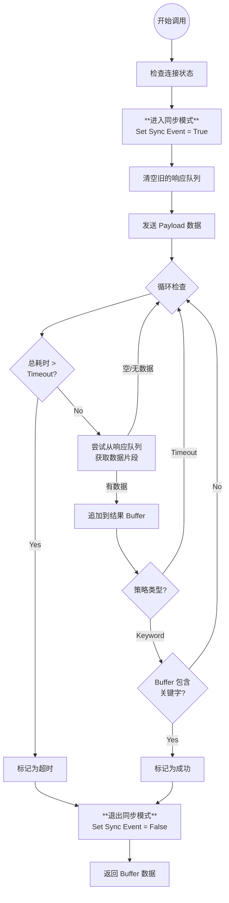
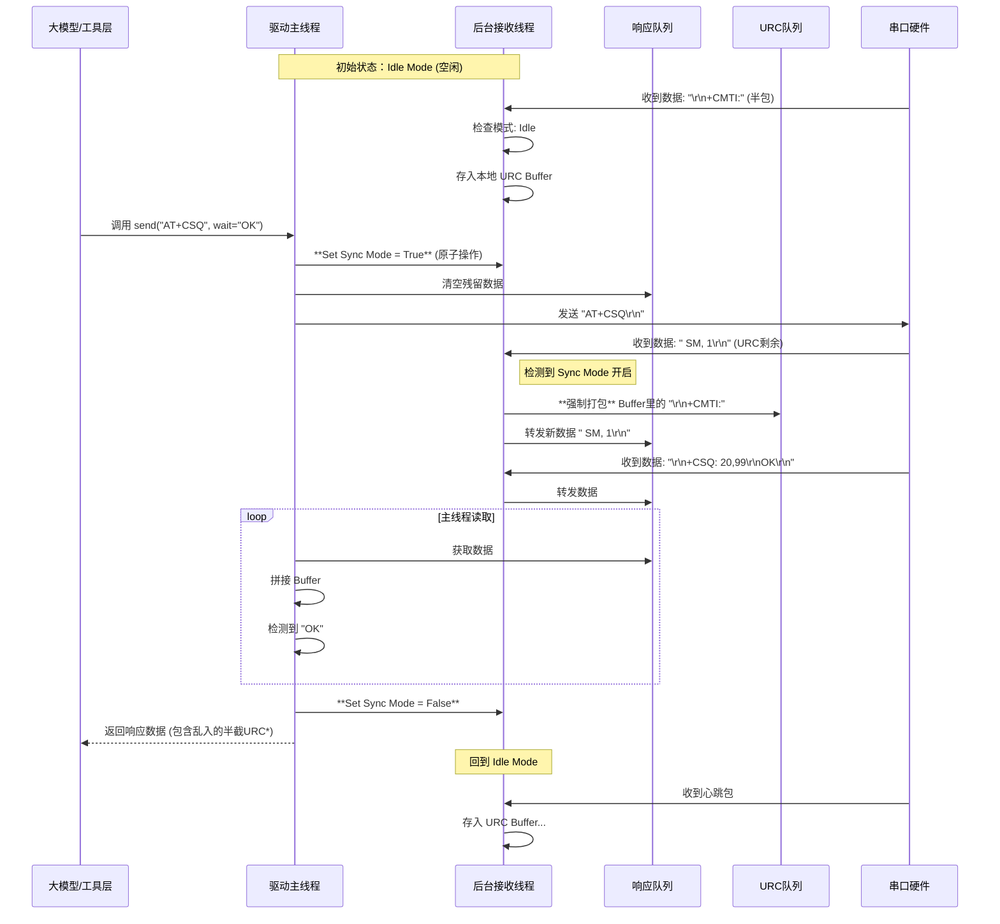

# 串口底层驱动设计规范 (Serial Driver Design Spec)

**版本:** V1.1 (Logic & Architecture Focus)  
**目标:** 构建一个无业务逻辑、线程安全、支持"同步指令"与"异步URC"自动分流的串口 I/O 引擎。

这是 Step 2: 底层驱动设计规范 (文档 3) 的修订版。  
根据您的要求，本文档不包含具体代码，而是侧重于核心逻辑描述、程序流程图 (Flowcharts) 和 时序图 (Sequence Diagrams)，以便于开发人员理解数据流向和并发控制机制。

## 1. 核心架构设计

### 1.1 生产者-消费者模型

本驱动采用 "单生产者 - 双消费者" 的并发模型来处理串口的全双工特性。

**生产者 (Background Reader):**
- 一个独立的守护线程，负责从物理串口持续读取字节流。
- 它是数据的唯一入口。

**消费者 A (同步响应通道):**
- 服务于大模型发起的 send_and_receive 请求。
- 当大模型在等待结果时，数据流向此通道。

**消费者 B (异步 URC 通道):**
- 服务于后台日志和通知系统。
- 当大模型空闲时，数据流向此通道，并根据时间切片自动打包。

### 1.2 状态控制机制 (Mode Switch)

为了决定数据流向哪个消费者，驱动内部维护一个原子状态标志 (Sync Event)：

- **Sync Mode (同步模式):** 标志位置位。表示"现在正在执行指令交互，所有收到的数据都属于当前指令的响应"。
- **Idle Mode (空闲模式):** 标志位复位。表示"现在没有主动请求，所有收到的数据都是设备自动上报的 URC"。

## 2. 详细逻辑流程图 (Logic Flowcharts)

### 2.1 后台接收线程逻辑 (The Background Producer)

这是驱动的心脏，负责数据的分流和 URC 的组包。

```mermaid
flowchart TD
    Start((线程启动)) --> CheckConn{串口已连接?}
    CheckConn -- No --> Exit((线程结束))
    CheckConn -- Yes --> HasData{硬件缓冲区<br>有数据?}
    
    %% 读取数据分支
    HasData -- Yes --> ReadBytes[读取字节流]
    ReadBytes --> IsSync{处于同步模式?<br>(Sync Event Set?)}
    
    %% 同步模式处理 (直接转发)
    IsSync -- Yes --> PushResp[写入同步响应队列<br>Response Queue]
    PushResp --> CheckURCBuffer{URC缓冲<br>非空?}
    CheckURCBuffer -- Yes --> ForceFlush[强制打包剩余URC<br>写入URC队列] --> ResetTimer
    CheckURCBuffer -- No --> ResetTimer[更新最后接收时间]
    
    %% 空闲模式处理 (缓冲+分包)
    IsSync -- No --> AppendBuff[追加到本地 URC Buffer]
    AppendBuff --> ResetTimer
    
    %% 空闲超时检查 (URC 分包核心逻辑)
    HasData -- No --> CheckBuff{URC Buffer<br>非空?}
    CheckBuff -- Yes --> TimeDiff{当前时间 - 最后接收时间<br> > 空闲阈值(100ms)?}
    TimeDiff -- Yes --> PackURC[打包 Buffer 内容<br>生成 URC 消息]
    PackURC --> PushURC[写入异步 URC 队列<br>URC Queue]
    PushURC --> ClearBuff[清空 URC Buffer]
    
    %% 循环
    ResetTimer --> Sleep[微小休眠 10ms]
    ClearBuff --> Sleep
    TimeDiff -- No --> Sleep
    CheckBuff -- No --> Sleep
    Sleep --> CheckConn
```

### 2.2 智能发送与接收逻辑 (Main Thread Action)

这是大模型调用工具时的主线程行为，负责控制模式切换和判定结束条件。



## 3. 关键交互时序图 (Sequence Diagram)

此图展示了最复杂的场景："在接收 URC 的过程中，突然插入了一条 AT 指令"。这能有效验证设计的鲁棒性。

**场景描述:**
- 设备正在上报一条短信通知 +CMTI: "SM", 1 (分两段到达)。
- 在短信第一段到达后，LLM 突然下发了查询指令 AT+CSQ。
- 驱动必须正确地将短信归类为 URC，将 +CSQ 的结果归类为响应。



## 4. 核心算法逻辑详述

### 4.1 空闲分包算法 (Idle Slicing Algorithm)

由于串口数据没有标准的"包头包尾"，我们使用时间作为分包依据。

**逻辑：**
1. 定义常量 IDLE_THRESHOLD = 0.1s (100ms)。
2. 每当从硬件收到一个字节，更新变量 last_received_time = current_time。
3. 如果 URC_Buffer 不为空，且 current_time - last_received_time > IDLE_THRESHOLD：
   - 判定：上一包数据传输完毕。
   - 动作：将 URC_Buffer 的内容深拷贝，封装成 URC_Message 对象，放入 URC_Queue。
   - 清理：清空 URC_Buffer。

### 4.2 混合数据流处理策略 (Mixed Stream Handling)

当"同步指令"与"异步URC"发生冲突（如时序图中所示）时，遵循以下设计权衡：

**原则：** 指令响应优先级 > URC 数据完整性。  
**理由：** LLM 正在等待回答，延迟是不可接受的。而 URC 晚一点处理没关系。  
**副作用：** 在极少数并发情况下，同步响应的数据包里可能会夹杂一部分 URC 数据（如 +CMTI... OK）。  
**解决方案：** 依靠 LLM 强大的文本清洗能力。我们在 System Prompt 中会指示模型："如果你在响应中看到了非预期的 URC 文本，请忽略它，并在后续通过 read_urc 工具查阅。"

### 4.3 编码自适应逻辑 (Encoding Adaptation)

为了防止二进制数据导致程序崩溃，底层驱动不应抛出解码异常。

**逻辑：**
1. 获取原始字节 raw_bytes。
2. 尝试 raw_bytes.decode('utf-8')。
3. 如果成功：返回 (string, format='utf8')。
4. 如果抛出 UnicodeDecodeError：
   - 捕捉异常。
   - 执行 raw_bytes.hex(' ') (转换为 "AA BB CC")。
   - 返回 (hex_string, format='hex')。

## 5. 接口定义 (Class Methods Abstract)

开发时需实现以下方法的具体逻辑：

- **connect(port, baudrate):** 初始化资源，启动 Reader 线程。
- **disconnect():** 设置停止事件，等待线程 Join，释放资源。
- **write(bytes):** 纯粹的硬件写入。
- **read_sync(wait_policy, parameter):** 封装了"进入Sync模式 -> 循环读取 -> 退出Sync模式"的完整生命周期。这是暴露给 MCP 工具层的唯一读取接口。
- **read_urc():** 简单的从 URC_Queue 中 get_all。