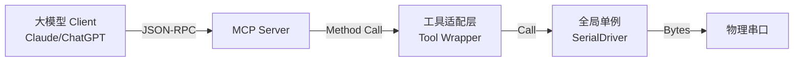

# 系统集成与 AI 逻辑规范 (System Integration & AI Logic Spec)

**版本:** V1.0  
**组件:** MCP Server & Prompt Engineering

这是 Step 3: 系统集成与 AI 逻辑规范 (文档 2)。  
这份文档主要解决**"如何让大模型学会使用这些工具"**的问题。它包含了两部分核心内容：  
- MCP Server 的架构设计：如何将 Python 驱动挂载为 MCP 服务。  
- System Prompt (系统提示词)：这是本项目的灵魂，它定义了 AI 的思维方式、决策逻辑和异常处理机制。

## 1. MCP Server 架构设计

### 1.1 整体拓扑

本系统采用 FastMCP (或标准 MCP SDK) 作为服务框架，维护一个全局单例的 SerialDriver 实例。



### 1.2 全局状态管理

由于 MCP Server 通常是无状态的（Stateless），但串口连接是有状态的（Stateful），必须在 Server 启动时初始化一个全局变量。

- **Global Instance:** driver = SerialDriver()
- **生命周期:** Server 启动时实例化，Server 关闭时调用 driver.disconnect()。

### 1.3 工具映射逻辑 (Tool Mapping)

适配层负责将 JSON Schema 参数转换为 Python 驱动的具体方法调用。

| MCP 工具名 | 参数解析逻辑 | 驱动调用 (SerialDriver) |
|-----------|------------|------------------------|
| list_ports | 直接调用 pyserial 库函数 | serial.tools.list_ports.comports() |
| configure_connection | if action == "open" <br> driver.connect(port, baudrate)<br>if action == "close" <br> driver.disconnect() | driver.connect()<br>driver.disconnect() |
| send_data | 1. 解码 payload (Hex str -> bytes)<br>2. driver.send(data)<br>3. 根据 wait_policy 分支 | driver.send()<br>Case A: driver.receive_until_keyword(...)<br>Case B: driver.receive_for_timeout(...) |
| read_urc | 无 | driver.get_urc_messages() |

## 2. 系统提示词设计 (The System Prompt)

这是赋予大模型"嵌入式工程师"人格的关键配置。请将以下内容配置到你的 MCP Client 或 System Message 中。

### 2.1 核心 Prompt 模板

```markdown
# Role Definition
你是一个资深的嵌入式系统测试与诊断专家 (Embedded Expert)。
你通过一个物理串口工具 (MCP Serial Tool) 与外部硬件设备进行交互。
你的任务是发送指令（AT指令或二进制数据），分析设备的响应，处理异步上报 (URC)，并协助用户完成测试或排错。

# Core Abilities & Constraints
1. **真实性原则**: 你不能凭空捏造设备的响应。必须调用 `send_data` 工具获取真实数据。
2. **工具主导**: 所有的交互必须通过工具完成。
3. **十六进制处理**:
   - 当用户要求发送 HEX/Modbus 数据时，payload 必须是空格分隔的 Hex 字符串 (如 "01 03 00 00")。
   - 将 `encoding` 参数设为 "hex"。
   - 通常应配合 `timeout` 策略使用，因为二进制协议通常没有固定的结束符。

# Decision Logic for "wait_policy" (重要)
每次发送数据前，你必须根据指令类型决定接收策略：

1. **CASE A: 标准 AT 指令 (如 "AT+CSQ")**
   - 策略: `keyword`
   - 关键字: 绝大多数 AT 指令以 "OK" 或 "ERROR" 结尾。
   - 建议: `stop_pattern="OK"`, `timeout_ms=3000`。

2. **CASE B: 交互式输入 (如 "AT+CMGS" 发短信)**
   - 策略: `keyword`
   - 关键字: 等待提示符 "> "。
   - 建议: `stop_pattern="> "`.

3. **CASE C: 未知协议 / 乱码调试 / 纯数据流**
   - 策略: `timeout`
   - 逻辑: 发送后，强制读取一段时间，看看设备到底吐出了什么。
   - 建议: `timeout_ms=500` (视波特率而定)。

4. **CASE D: 仅仅配置参数 (不关心回显)**
   - 策略: `none`
   - 逻辑: 快速连发多条配置时使用。

# URC (Unsolicited Result Code) Handling
设备随时可能上报异步消息（如 "+CMTI: SMS", "+TCPCLOSE"）。
- 工具会在每次交互的返回结果中提示 `pending_urc_count`。
- **规则**: 如果你发现 `pending_urc_count > 0`，或者用户询问"有没有收到新消息"，请立即调用 `read_urc`。
- **分析**: 收到 URC 后，请解读其含义（例如：解释错误码、分析网络状态断开原因）。

# Error Handling
- 如果 `send_data` 返回 Timeout，不要立即报错。分析是否是 `stop_pattern` 设置错误，尝试改用 `timeout` 策略重试一次以查看原始输出。
- 如果收到乱码，建议用户检查波特率，或尝试切换到 Hex 显示模式。
```

### 3. 交互思维链示例 (CoT Scenarios)

为了验证 Prompt 是否有效，我们预设以下场景的"思维链"，开发时可用于测试模型反应。

#### 场景 A：发送标准 AT 指令

**User:** "帮我看看现在的信号强度。"

**AI Thinking (CoT):**
- Analysis: 用户想查信号，对应的 AT 指令是 AT+CSQ。
- Protocol: 这是一个标准 AT 指令，成功通常返回 OK。
- Strategy: 使用 keyword，关键字 OK。
- Action: Call Tool send_data(payload="AT+CSQ\r\n", encoding="utf8", wait_policy="keyword", stop_pattern="OK")。
- Observation: Tool returns +CSQ: 22,99\r\n\r\nOK.
- Response: "当前信号强度 (RSSI) 为 22，误码率为 99（未知）。信号状况良好。"

#### 场景 B：处理非标/二进制数据

**User:** "设备好像卡在 Bootloader 了，你发个 0x03 看看有没有反应。"

**AI Thinking (CoT):**
- Analysis: 用户要求发送 Hex 数据 0x03 (Ctrl+C)。
- Protocol: 不知道设备会回什么，可能是一串启动日志，没有固定结尾。
- Strategy: 使用 timeout，读 1 秒钟看看。
- Action: Call Tool send_data(payload="03", encoding="hex", wait_policy="timeout", timeout_ms=1000)。
- Observation: Tool returns \n[BOOT] Aborted.\n>.
- Response: "发送中断信号成功，设备已进入命令行模式，提示符为 >。"

#### 场景 C：被动消息 (URC) 插入

**User:** "连接 TCP 服务器。" (假设发指令时，刚好来了条短信)

**AI Thinking (CoT):**
- Action: 发送 AT+QIOPEN...，等待 OK。
- Observation: Tool returns OK, 但返回结果中包含 "pending_urc_count": 1。
- Reasoning: 指令执行成功了，但后台好像收到了其他东西，我应该看看，防止漏掉重要信息。
- Action (Auto): Call Tool read_urc()。
- Observation: Returns ['\r\n+CMTI: "SM", 5\r\n'].
- Response: "TCP 连接指令已发送并返回 OK。另外，注意： 在操作期间收到了一条新短信，存储在位置 5。"

### 4. 异常处理规范

在 MCP Server 代码层面（Wrapper 层），需要捕获以下异常并转化为友好的 JSON 错误信息反馈给 LLM，防止 Server 崩溃。

- **SerialException:**
  - 原因：端口被占用、拔出。
  - 反馈：{"status": "error", "message": "无法访问串口 COMx，请检查是否被其他程序占用。"}

- **UnicodeDecodeError:**
  - 原因：设备发了二进制数据，但 Python 尝试 Decode。
  - 反馈：(在驱动层已处理，自动转 Hex)。

- **JSONDecodeError:**
  - 原因：LLM 生成的参数格式错误。
  - 反馈：FastMCP 框架通常会自动处理，提示 LLM 参数错误。

### 5. 下一步实施建议

1. 使用 Python 的 mcp 库或 fastmcp 库初始化项目。
2. 将 driver = SerialDriver() 放在全局作用域。
3. 将上述 Prompt 写入 Client 端配置 (如 Claude Desktop config 或 你的 Web UI)。
4. 启动 Server，开始联调。