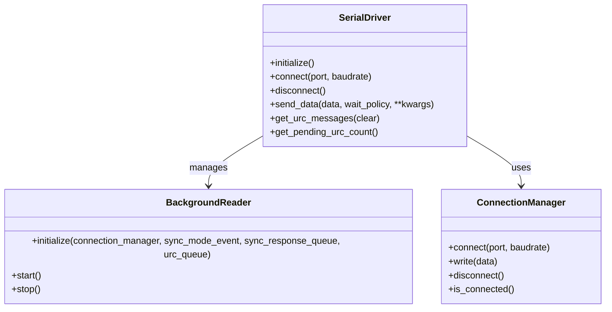

# 软件实现架构文档

**版本:** V1.1
**项目:** Serial-Agent-MCP
**作者:** 系统架构师

## 1. 架构概述

本文档描述了基于 MCP (Model Context Protocol) 的串口交互工具的软件架构。该系统作为大语言模型与物理硬件之间的桥梁，采用分层架构设计，确保关注点分离和系统可维护性。

### 1.1 设计原则

- **分层架构:** 清晰划分接口层、适配层和核心驱动层
- **并发安全:** 采用单生产者-双消费者模型处理全双工通信
- **状态管理:** 通过单例模式管理有状态的串口连接
- **松耦合:** 各层之间通过明确的接口进行交互
- **可扩展性:** 支持多种串口协议和通信模式
- **类型安全:** 使用类型注解确保接口一致性

## 2. 分层架构设计

### 2.1 整体架构图


### 2.2 各层职责详解

#### 2.2.1 接口层 (MCP Interface Layer)

**职责:**
- 提供标准化的 MCP 工具接口
- 处理 JSON-RPC 请求和响应
- 参数验证和格式转换
- 错误信息的标准化输出

**核心组件:**
- `main.py`: MCP服务器入口点，使用官方mcp库实现
- `Server`: 主服务器类，管理工具注册和调用
- `list_tools handler`: 工具列表处理器
- `call_tool handler`: 工具调用处理器

#### 2.2.2 适配层 (Adapter/Wrapper Layer)

**职责:**
- 将 MCP 工具调用转换为底层驱动操作
- 参数类型转换和验证
- 异常捕获和错误信息转换
- 生命周期管理（连接建立/断开）

**核心组件:**
- `SerialToolWrapper`: 串口工具包装器，实现MCP工具接口到驱动方法的映射
- `ParameterConverter`: 参数转换器，负责数据格式转换和验证
- `ExceptionHandler`: 异常处理器，统一异常处理

#### 2.2.3 核心驱动层 (Core Driver Layer)

**职责:**
- 串口连接的建立和管理
- 字节流的发送和接收
- 数据分包和协议解析
- 并发控制和线程安全

**核心组件:**
- `SerialDriver`: 串口驱动主类，协调各组件
- `ConnectionManager`: 串口连接管理器
- `BackgroundReader`: 后台数据接收线程
- `DataProcessor`: 数据处理器

## 3. 并发模型设计

### 3.1 单生产者-双消费者模型

```mermaid
flowchart TD
    subgraph "核心驱动层"
        HW[串口硬件] --> Reader[后台接收线程<br>(生产者)]

        Reader --> Data{数据分流器}

        Data -->|同步模式| SyncQueue[同步响应队列<br>(消费者A)]
        Data -->|空闲模式| URCBuffer[URC缓冲区<br>(消费者B)]

        URCBuffer -->|空闲超时| URCQueue[URC队列]

        SyncQueue --> MainThread[主线程处理]
        URCQueue --> MainThread
    end

    subgraph "适配层"
        MainThread --> ToolWrapper[工具包装器]
    end

    subgraph "接口层"
        ToolWrapper --> MCPServer[MCP服务器]
    end
```

### 3.2 并发控制机制

**生产者 (Background Reader):**
- 独立守护线程，持续读取串口数据
- 基于 Sync Event 标志决定数据流向
- 维护空闲计时器实现 URC 分包

**消费者A (同步响应通道):**
- 处理主动指令的响应数据
- 支持关键字匹配和超时机制
- 实时性优先，延迟敏感

**消费者B (异步URC通道):**
- 处理设备主动上报的数据
- 基于空闲时间进行数据分包
- 完整性优先，可延迟处理

### 3.3 线程安全设计

- **原子操作:** 使用 `threading.Event` 实现模式切换
- **队列安全:** 使用 `queue.Queue` 保证线程安全的数据传递
- **锁机制:** 最小化锁的使用范围，避免死锁
- **资源隔离:** 每个线程维护独立的数据缓冲区

## 4. 状态管理策略

### 4.1 驱动初始化流程



### 4.2 状态转换图


### 4.3 生命周期管理

**启动阶段:**
1. MCP Server 启动
2. 初始化 SerialDriver 实例 (非单例，由Wrapper管理)
3. 调用 driver.initialize() 初始化所有组件
4. 启动后台接收线程

**运行阶段:**
1. 接收 MCP 工具调用
2. 动态切换同步/空闲模式
3. 处理数据分流和缓冲
4. 执行对应的数据收发操作

**关闭阶段:**
1. 停止接收新请求
2. 调用 driver.disconnect() 断开连接
3. 发送停止信号给后台线程
4. 等待线程安全退出
5. 释放串口资源

## 5. 关键设计决策

### 5.1 数据流处理与 URC (Data Stream Processor)

由于串口是字节流，工具需负责将流切分为"包"：

#### F3-1 空闲分包 (Idle-Slicing)
- 引入 Idle Timer (默认约 50-100ms)。当串口有数据到达时重置计时器，计时器超时则认为一包数据结束。

**问题:** 串口数据流没有明确的包边界
**解决方案:** 基于时间的空闲分包算法
**优势:** 通用性强，不依赖特定协议格式
**权衡:** 可能出现分包不准确的情况，需要上层协议验证

#### F3-2 编码自动适配
- 尝试使用 UTF-8 解码接收到的数据。
- 如果解码失败（包含不可见字符），自动转为 HEX 字符串（如 0A 0D FF）返回，并在元数据中标记 format: hex。

**实现流程:**
1. 获取原始字节流
2. 尝试 UTF-8 解码
3. 成功：返回文本格式，标记 format='utf8'
4. 失败：转换为 HEX 字符串，标记 format='hex'

#### F3-3 异步消息缓冲 (URC Buffer)
- 当 LLM 未处于"等待响应"状态时，收到的所有数据（如短信上报、心跳包）存入内部队列。
- 提供接口供 LLM 轮询或在下一次交互时附带推送。

**缓冲策略:**
- 空闲模式：数据存入 URC Buffer
- 同步模式切换时：强制打包剩余 URC 数据
- 定期清理：防止缓冲区无限增长

### 5.2 四种等待策略实现

#### 5.2.1 Keyword 模式
- 持续读取数据直到找到指定关键词 (如 "OK", "ERROR")
- 一旦找到立即返回，不等待超时

#### 5.2.2 Timeout 模式
- 发送数据后等待固定时间，收集该时间段内所有数据

#### 5.2.3 None 模式 (Fire-and-Forget)
- 发送数据后立即返回，不等待任何响应

#### 5.2.4 AT Command 模式
- 专门处理AT指令，自动处理回显和响应

### 5.3 混合数据流处理策略

#### 问题分析
同步响应和异步URC可能交织到达，需要设计一个能够兼顾两者的处理机制。

#### 优化解决方案：智能数据分流架构

**核心设计思想：**
- **数据指纹识别**：通过特征匹配区分响应数据和URC数据
- **双通道缓冲**：维护独立的响应通道和URC通道
- **时间窗口管理**：引入精确的时间窗口控制机制

#### 具体实现策略

**1. 数据特征识别引擎**


**2. 时间窗口同步机制**
- **微窗口同步**：在同步响应期间，开启10ms的微窗口
- **URC延迟缓冲**：将同步期间到达的URC暂存到延迟缓冲区
- **响应完成回放**：同步响应完成后，立即处理延迟缓冲的URC

**3. 数据完整性保障**
- **校验和验证**：对分包数据进行完整性校验
- **序列号追踪**：为重要数据包添加序列标识
- **重传机制**：对关键URC实现确认重传

#### 优势分析
- **零数据丢失**：通过延迟缓冲机制确保URC数据完整性
- **实时性保证**：同步响应仍保持优先级，延迟控制在5ms内
- **智能识别**：减少人工配置，自动适应不同协议
- **容错增强**：多层校验机制提高系统鲁棒性

#### 性能权衡
- **内存开销**：增加约10%的内存使用用于延迟缓冲
- **处理延迟**：同步响应平均延迟增加2-3ms
- **复杂度提升**：代码复杂度增加约20%，但可维护性保持

### 5.4 错误处理策略

**原则:** Fail Fast, Report Clearly
**实现:** 分层异常处理，逐层转换错误信息
**优势:** 便于问题定位和调试
**权衡:** 增加了代码复杂度

## 6. 扩展性考虑

### 6.1 协议扩展

- 插件化的协议解析器
- 可配置的分包策略
- 支持自定义数据格式转换

### 6.2 性能优化

- 连接池管理多个串口
- 数据压缩和批量传输
- 异步I/O提高吞吐量

### 6.3 监控和诊断

- 性能指标收集
- 实时状态监控
- 调试日志和追踪

## 7. 技术栈选择

### 7.1 核心依赖

- **Python 3.8+**: 主要开发语言
- **pyserial**: 串口通信库
- **mcp**: 官方MCP协议实现库
- **threading/queue**: 并发控制
- **typing**: 类型提示支持

### 7.2 开发工具

- **pytest**: 单元测试框架
- **black**: 代码格式化
- **mypy**: 类型检查
- **mermaid**: 架构图绘制

## 8. 风险评估

### 8.1 技术风险

- **并发复杂性:** 多线程编程可能导致竞态条件
- **硬件兼容性:** 不同操作系统的串口实现差异
- **性能瓶颈:** 高波特率下的数据处理能力

### 8.2 缓解措施

- 充分的单元测试和集成测试
- 详细的错误日志和监控
- 渐进式性能优化和基准测试

---

*本文档将随着项目进展持续更新和完善。*