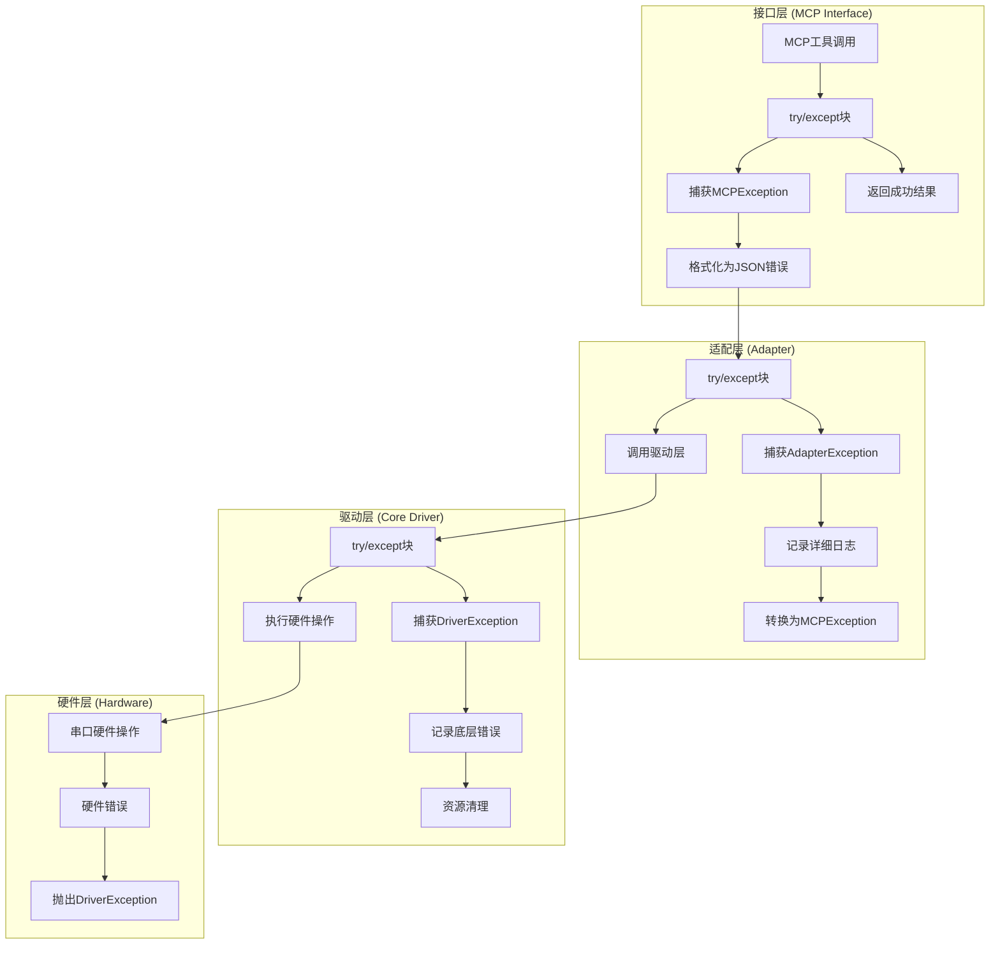

# 软件实现架构文档 - 实现细节

**版本:** V1.0  
**项目:** Serial-Agent-MCP  
**作者:** 高级 Python 开发工程师

## 1. 工程结构

### 1.1 项目目录结构

```
serial2mcp/
├── README.md                    # 项目说明文档
├── requirements.txt             # Python 依赖列表
├── setup.py                     # 包安装配置
├── pyproject.toml              # 现代Python项目配置
├── .gitignore                  # Git忽略文件
├── .github/                    # GitHub Actions CI/CD
│   └── workflows/
│       └── test.yml
├── src/                        # 源代码目录
│   └── serial2mcp/
│       ├── __init__.py
│       ├── main.py             # MCP服务器入口点
│       ├── server.py           # MCP服务器主类
│       ├── tools/              # MCP工具实现
│       │   ├── __init__.py
│       │   ├── base.py         # 基础工具类
│       │   ├── connection.py   # 连接管理工具
│       │   ├── communication.py # 通信工具
│       │   └── urc.py          # URC处理工具
│       ├── driver/             # 核心驱动层
│       │   ├── __init__.py
│       │   ├── serial_driver.py # 串口驱动主类
│       │   ├── reader.py       # 后台接收线程
│       │   ├── processor.py    # 数据处理器
│       │   └── connection_manager.py # 连接管理
│       ├── adapter/            # 适配层
│       │   ├── __init__.py
│       │   ├── wrapper.py      # 工具包装器
│       │   ├── converter.py    # 参数转换器
│       │   └── exception_handler.py # 异常处理器
│       └── utils/              # 工具类
│           ├── __init__.py
│           ├── logger.py       # 日志配置
│           ├── config.py       # 配置管理
│           └── exceptions.py   # 自定义异常
├── tests/                      # 测试代码
│   ├── __init__.py
│   ├── conftest.py            # pytest配置
│   ├── unit/                  # 单元测试
│   │   ├── test_driver/
│   │   ├── test_adapter/
│   │   └── test_tools/
│   ├── integration/           # 集成测试
│   │   ├── test_mcp_server.py
│   │   └── test_serial_flow.py
│   └── fixtures/              # 测试数据
│       └── mock_serial.py
├── docs/                      # 文档目录
│   ├── architecture/          # 架构文档
│   ├── api/                   # API文档
│   └── examples/              # 使用示例
├── examples/                  # 示例代码
│   ├── basic_usage.py
│   └── advanced_scenarios.py
└── scripts/                   # 辅助脚本
    ├── setup_dev_env.sh
    └── run_tests.sh
```

### 1.2 PEP 8 合规性

- 使用 4 个空格缩进
- 行长度限制为 88 字符 (Black 默认)
- 类名使用 PascalCase
- 函数和变量使用 snake_case
- 常量使用 UPPER_CASE
- 私有成员使用单下划线前缀

## 2. 依赖管理

### 2.1 核心依赖 (requirements.txt)

```
# 核心依赖
pyserial>=3.5              # 串口通信
fastmcp>=0.2.0             # MCP协议实现
typing-extensions>=4.0.0   # 类型注解支持

# 异步支持
asyncio-mqtt>=0.13.0       # 异步MQTT支持(可选)

# 数据处理
numpy>=1.21.0              # 数值计算(可选)
protobuf>=3.20.0           # 协议缓冲区(可选)

# 日志和监控
structlog>=22.1.0          # 结构化日志
prometheus-client>=0.14.0  # 指标收集(可选)
```

### 2.2 开发依赖 (requirements-dev.txt)

```
# 测试框架
pytest>=7.0.0
pytest-asyncio>=0.20.0
pytest-cov>=4.0.0
pytest-mock>=3.8.0

# 代码质量
black>=22.0.0
isort>=5.10.0
flake8>=5.0.0
mypy>=0.991
pre-commit>=2.20.0

# 文档生成
sphinx>=5.0.0
sphinx-rtd-theme>=1.0.0
myst-parser>=0.18.0

# 开发工具
ipython>=8.0.0
jupyter>=1.0.0
```

### 2.3 依赖用途说明

| 库名称 | 版本要求 | 用途描述 |
|--------|----------|----------|
| pyserial | >=3.5 | 跨平台串口通信，支持Windows/Linux/macOS |
| fastmcp | >=0.2.0 | MCP协议的Python实现，提供服务器框架 |
| typing-extensions | >=4.0.0 | 向后兼容的类型注解支持 |
| structlog | >=22.1.0 | 结构化日志，便于调试和监控 |
| pytest | >=7.0.0 | 单元测试和集成测试框架 |

## 3. 错误处理策略

### 3.1 异常层级设计

```python
# utils/exceptions.py

class Serial2MCPException(Exception):
    """基础异常类，所有自定义异常的父类"""
    def __init__(self, message: str, error_code: str = None):
        super().__init__(message)
        self.message = message
        self.error_code = error_code

class DriverException(Serial2MCPException):
    """驱动层异常"""
    pass

class ConnectionException(DriverException):
    """连接相关异常"""
    pass

class DataException(DriverException):
    """数据处理异常"""
    pass

class AdapterException(Serial2MCPException):
    """适配层异常"""
    pass

class ValidationException(AdapterException):
    """参数验证异常"""
    pass

class MCPException(Serial2MCPException):
    """MCP接口层异常"""
    pass
```

### 3.2 异常捕获层级



### 3.3 Fail Fast 原则实现

```python
# adapter/exception_handler.py

import logging
from typing import Dict, Any
from ..utils.exceptions import Serial2MCPException

class ExceptionHandler:
    def __init__(self, logger: logging.Logger):
        self.logger = logger
    
    def handle_exception(self, exc: Exception, context: str = "") -> Dict[str, Any]:
        """
        统一异常处理，遵循 Fail Fast, Report Clearly 原则
        
        Args:
            exc: 捕获的异常
            context: 异常发生的上下文信息
            
        Returns:
            格式化的错误响应字典
        """
        error_info = {
            "status": "error",
            "error_type": type(exc).__name__,
            "context": context,
            "timestamp": time.time()
        }
        
        if isinstance(exc, Serial2MCPException):
            # 自定义异常，包含详细信息
            error_info.update({
                "error_code": exc.error_code,
                "message": exc.message
            })
            self.logger.error(f"Custom exception in {context}: {exc.message}", 
                            extra={"error_code": exc.error_code})
        else:
            # 系统异常，保护敏感信息
            error_info.update({
                "message": "Internal system error",
                "error_code": "SYS_ERROR"
            })
            self.logger.error(f"System exception in {context}: {str(exc)}", exc_info=True)
        
        return error_info
    
    def validate_parameters(self, params: Dict[str, Any], schema: Dict[str, Any]) -> None:
        """
        参数验证，Fail Fast 的第一道防线
        
        Raises:
            ValidationException: 参数验证失败时立即抛出
        """
        try:
            # 使用 jsonschema 或类似库进行验证
            validate(instance=params, schema=schema)
        except ValidationError as e:
            raise ValidationException(
                f"Parameter validation failed: {e.message}",
                error_code="VALIDATION_ERROR"
            )
```

### 3.4 错误恢复策略

```python
# driver/connection_manager.py

class ConnectionManager:
    def __init__(self):
        self.retry_config = {
            "max_retries": 3,
            "backoff_factor": 2,
            "timeout": 5.0
        }
    
    def connect_with_retry(self, port: str, baudrate: int) -> bool:
        """
        带重试机制的连接方法
        
        Returns:
            bool: 连接是否成功
        """
        for attempt in range(self.retry_config["max_retries"]):
            try:
                self._connect(port, baudrate)
                return True
            except ConnectionException as e:
                if attempt == self.retry_config["max_retries"] - 1:
                    raise  # 最后一次重试失败，抛出异常
                
                wait_time = self.retry_config["backoff_factor"] ** attempt
                time.sleep(wait_time)
                logger.warning(f"Connection attempt {attempt + 1} failed, retrying in {wait_time}s")
        
        return False
```

## 4. 核心类实现示例

### 4.1 增强的全局单例管理

```python
# driver/serial_driver.py

import threading
import time
import queue
from typing import Optional, List, Dict, Any
from dataclasses import dataclass
from .reader import DataPacket, DataType

@dataclass
class ConnectionMetrics:
    """连接性能指标"""
    bytes_sent: int = 0
    bytes_received: int = 0
    packets_sent: int = 0
    packets_received: int = 0
    errors_count: int = 0
    average_response_time: float = 0.0
    uptime: float = 0.0
    last_activity: float = 0.0

class SerialDriverSingleton:
    """增强的全局单例管理器"""
    _instance: Optional['SerialDriver'] = None
    _lock = threading.Lock()
    
    @classmethod
    def get_instance(cls) -> 'SerialDriver':
        """获取全局单例实例"""
        if cls._instance is None:
            with cls._lock:
                if cls._instance is None:  # 双重检查锁定
                    cls._instance = SerialDriver()
        return cls._instance
    
    @classmethod
    def reset_instance(cls) -> None:
        """重置单例实例，主要用于测试"""
        with cls._lock:
            if cls._instance is not None:
                cls._instance.disconnect()
                cls._instance = None

class SerialDriver:
    """增强的串口驱动主类"""
    
    def __init__(self):
        # 连接相关
        self._connection = None
        self._reader_thread = None
        self._stop_event = threading.Event()
        
        # 同步控制
        self._sync_mode = threading.Event()
        self._sync_start_time = 0.0
        
        # 队列系统（使用优先级队列）
        self._response_queue = queue.PriorityQueue(maxsize=1000)
        self._urc_queue = queue.PriorityQueue(maxsize=1000)
        self._urc_buffer: List[DataPacket] = []
        
        # 时间管理
        self._last_received_time = time.time()
        self._connection_start_time = time.time()
        
        # 命令历史（用于上下文判断）
        self._recent_commands: List[Dict[str, Any]] = []
        self._commands_lock = threading.Lock()
        
        # 性能指标
        self._metrics = ConnectionMetrics()
        self._metrics_lock = threading.Lock()
        
        # 配置参数
        self._config = {
            'idle_threshold': 0.1,      # 100ms空闲阈值
            'max_buffer_size': 4096,    # 最大缓冲区大小
            'sync_timeout': 30.0,       # 同步超时时间
            'max_command_history': 10   # 最大命令历史记录数
        }
    
    def connect(self, port: str, baudrate: int) -> None:
        """建立串口连接"""
        if self._connection is not None:
            raise ConnectionException("Already connected to a serial port")
        
        try:
            # 建立连接
            self._connection = serial.Serial(
                port=port,
                baudrate=baudrate,
                timeout=0.01,  # 10ms超时，提高响应性
                write_timeout=1.0
            )
            
            # 启动后台接收线程
            self._reader_thread = BackgroundReader(self)
            self._reader_thread.start()
            
            # 重置指标
            self._connection_start_time = time.time()
            self._metrics.uptime = 0.0
            
            logger.info(f"Connected to {port} at {baudrate} baud")
            
        except serial.SerialException as e:
            raise ConnectionException(f"Failed to connect to {port}: {str(e)}")
    
    def disconnect(self) -> None:
        """断开串口连接"""
        if self._connection is not None:
            logger.info("Disconnecting serial port...")
            
            # 设置停止事件
            self._stop_event.set()
            
            # 等待线程结束
            if self._reader_thread is not None:
                self._reader_thread.join(timeout=2.0)
                if self._reader_thread.is_alive():
                    logger.warning("Reader thread did not stop gracefully")
            
            # 关闭连接
            try:
                self._connection.close()
            except Exception as e:
                logger.error(f"Error closing serial connection: {e}")
            
            # 清理状态
            self._connection = None
            self._reader_thread = None
            self._sync_mode.clear()
            
            # 清空队列
            self._clear_queues()
            
            logger.info("Serial port disconnected")
    
    def send_data(self, data: bytes, is_hex: bool = False) -> None:
        """发送数据（增强版）"""
        if self._connection is None:
            raise ConnectionException("Serial port not connected")
        
        try:
            # 记录命令历史
            self._record_command(data, is_hex)
            
            # 发送数据
            bytes_written = self._connection.write(data)
            self._connection.flush()
            
            # 更新指标
            with self._metrics_lock:
                self._metrics.bytes_sent += bytes_written
                self._metrics.packets_sent += 1
                self._metrics.last_activity = time.time()
            
            logger.debug(f"Sent {bytes_written} bytes: {data[:50]}...")
            
        except serial.SerialException as e:
            with self._metrics_lock:
                self._metrics.errors_count += 1
            raise DataException(f"Failed to send data: {str(e)}")
    
    def receive_sync(self, timeout: float = 5.0) -> Optional[Dict[str, Any]]:
        """同步接收数据（增强版）"""
        if self._connection is None:
            raise ConnectionException("Serial port not connected")
        
        # 进入同步模式
        self._sync_mode.set()
        self._sync_start_time = time.time()
        
        try:
            # 等待响应
            start_time = time.time()
            while time.time() - start_time < timeout:
                try:
                    # 非阻塞获取响应
                    priority, response = self._response_queue.get(timeout=0.01)
                    
                    # 更新指标
                    with self._metrics_lock:
                        self._metrics.packets_received += 1
                        response_time = time.time() - self._sync_start_time
                        self._update_average_response_time(response_time)
                    
                    return response
                    
                except queue.Empty:
                    continue
                
                # 检查同步超时
                if time.time() - self._sync_start_time > self._config['sync_timeout']:
                    logger.warning("Sync mode timeout reached")
                    break
            
            return None
            
        finally:
            # 退出同步模式
            self._sync_mode.clear()
    
    def get_urc_messages(self, clear: bool = True) -> List[Dict[str, Any]]:
        """获取URC消息（增强版）"""
        urc_messages = []
        
        while not self._urc_queue.empty():
            try:
                priority, urc = self._urc_queue.get_nowait()
                urc_messages.append(urc)
            except queue.Empty:
                break
        
        return urc_messages
    
    def get_metrics(self) -> Dict[str, Any]:
        """获取连接指标"""
        with self._metrics_lock:
            metrics = self._metrics.__dict__.copy()
            metrics['uptime'] = time.time() - self._connection_start_time
            metrics['connection_status'] = 'connected' if self._connection else 'disconnected'
            
            # 添加队列状态
            metrics['response_queue_size'] = self._response_queue.qsize()
            metrics['urc_queue_size'] = self._urc_queue.qsize()
            metrics['urc_buffer_size'] = len(self._urc_buffer)
            
            return metrics
    
    def _record_command(self, data: bytes, is_hex: bool) -> None:
        """记录命令历史"""
        with self._commands_lock:
            command = {
                'data': data.hex(' ') if is_hex else data.decode('utf-8', errors='ignore'),
                'is_hex': is_hex,
                'timestamp': time.time()
            }
            
            self._recent_commands.append(command)
            
            # 限制历史记录数量
            if len(self._recent_commands) > self._config['max_command_history']:
                self._recent_commands.pop(0)
    
    def _update_average_response_time(self, response_time: float) -> None:
        """更新平均响应时间"""
        if self._metrics.packets_received == 1:
            self._metrics.average_response_time = response_time
        else:
            # 使用指数移动平均
            alpha = 0.1
            self._metrics.average_response_time = (
                alpha * response_time + 
                (1 - alpha) * self._metrics.average_response_time
            )
    
    def _clear_queues(self) -> None:
        """清空所有队列"""
        while not self._response_queue.empty():
            try:
                self._response_queue.get_nowait()
            except queue.Empty:
                break
        
        while not self._urc_queue.empty():
            try:
                self._urc_queue.get_nowait()
            except queue.Empty:
                break
        
        self._urc_buffer.clear()
    
    @property
    def recent_commands(self) -> List[Dict[str, Any]]:
        """获取最近的命令历史"""
        with self._commands_lock:
            return self._recent_commands.copy()
    
    @property
    def is_sync_mode(self) -> bool:
        """检查是否处于同步模式"""
        return self._sync_mode.is_set()
```

### 4.2 智能数据分流后台接收线程

```python
# driver/reader.py

import time
import threading
import re
from queue import Queue, PriorityQueue
from typing import Optional, Dict, Any, List
from dataclasses import dataclass, field
from enum import Enum

class DataType(Enum):
    RESPONSE = "response"
    URC = "urc"
    UNKNOWN = "unknown"

@dataclass
class DataPacket:
    data: str
    is_hex: bool
    timestamp: float
    data_type: DataType
    priority: int = 0
    sequence_id: Optional[int] = None
    checksum: Optional[str] = None

class PatternMatcher:
    """数据模式识别引擎"""
    
    def __init__(self):
        # AT响应模式
        self.response_patterns = [
            r'\bOK\b',
            r'\bERROR\b',
            r'\bCONNECT\b',
            r'\bNO CARRIER\b',
            r'\bBUSY\b',
            r'\bNO ANSWER\b',
            r'\+r\d+,\d+',  # 通用响应格式
        ]
        
        # URC模式
        self.urc_patterns = [
            r'\+CMTI:',     # 短信通知
            r'\+CMT:',      # 短信内容
            r'\+CLIP:',     # 来电显示
            r'\+CREG:',     # 网络注册
            r'\+CGATT:',    # GPRS附着
            r'\+QIURC:',    # 移远URC
            r'\+TCP',       # TCP相关
            r'\+UDP',       # UDP相关
        ]
        
        # 编译正则表达式
        self.response_regex = [re.compile(pattern, re.IGNORECASE) 
                             for pattern in self.response_patterns]
        self.urc_regex = [re.compile(pattern, re.IGNORECASE) 
                         for pattern in self.urc_patterns]
    
    def identify_data_type(self, data: str, context: Dict[str, Any]) -> DataType:
        """智能识别数据类型"""
        # 首先检查明确的模式匹配
        for regex in self.response_regex:
            if regex.search(data):
                return DataType.RESPONSE
        
        for regex in self.urc_regex:
            if regex.search(data):
                return DataType.URC
        
        # 基于上下文判断
        if context.get('sync_mode', False):
            # 同步模式下，优先认为是响应
            if self._likely_response(data):
                return DataType.RESPONSE
        
        # 默认根据模式判断
        return DataType.URC if context.get('idle_mode', False) else DataType.UNKNOWN
    
    def _likely_response(self, data: str) -> bool:
        """判断是否可能是响应数据"""
        # 简单的启发式规则
        indicators = ['OK', 'ERROR', '>', 'CONNECT', 'busy', 'no carrier']
        return any(indicator.lower() in data.lower() for indicator in indicators)

class DelayedURCBuffer:
    """URC延迟缓冲区"""
    
    def __init__(self, max_delay: float = 0.005):  # 5ms最大延迟
        self.buffer: List[DataPacket] = []
        self.max_delay = max_delay
        self.lock = threading.Lock()
    
    def add(self, packet: DataPacket) -> None:
        """添加URC到延迟缓冲区"""
        with self.lock:
            self.buffer.append(packet)
    
    def flush(self) -> List[DataPacket]:
        """清空缓冲区并返回所有URC"""
        with self.lock:
            packets = self.buffer.copy()
            self.buffer.clear()
            return packets
    
    def should_flush(self, current_time: float) -> bool:
        """检查是否应该刷新缓冲区"""
        if not self.buffer:
            return False
        
        oldest_packet = self.buffer[0]
        return current_time - oldest_packet.timestamp > self.max_delay

class BackgroundReader(threading.Thread):
    def __init__(self, driver: 'SerialDriver'):
        super().__init__(daemon=True)
        self.driver = driver
        self.IDLE_THRESHOLD = 0.1  # 100ms
        self.MICRO_WINDOW = 0.01   # 10ms微窗口
        
        # 智能分流组件
        self.pattern_matcher = PatternMatcher()
        self.delayed_urc_buffer = DelayedURCBuffer()
        
        # 序列号管理
        self.sequence_counter = 0
        self.sequence_lock = threading.Lock()
        
        # 性能统计
        self.stats = {
            'total_packets': 0,
            'response_packets': 0,
            'urc_packets': 0,
            'unknown_packets': 0,
            'delayed_urc_count': 0
        }
    
    def run(self) -> None:
        """后台接收线程主循环"""
        while not self.driver._stop_event.is_set():
            try:
                current_time = time.time()
                
                if self.driver._connection.in_waiting > 0:
                    # 读取数据
                    raw_data = self.driver._connection.read(self.driver._connection.in_waiting)
                    self._process_data_intelligent(raw_data, current_time)
                else:
                    # 检查空闲超时和延迟缓冲区
                    self._check_timeouts(current_time)
                
                time.sleep(0.005)  # 5ms 间隔，提高响应性
                
            except Exception as e:
                logger.error(f"Error in background reader: {str(e)}")
                break
    
    def _process_data_intelligent(self, raw_data: bytes, current_time: float) -> None:
        """智能数据处理"""
        # 解码数据
        try:
            text_data = raw_data.decode('utf-8')
            is_hex = False
        except UnicodeDecodeError:
            text_data = raw_data.hex(' ')
            is_hex = True
        
        # 创建数据包
        packet = self._create_data_packet(text_data, is_hex, current_time)
        
        # 智能分流
        context = {
            'sync_mode': self.driver._sync_mode.is_set(),
            'idle_mode': not self.driver._sync_mode.is_set(),
            'recent_commands': getattr(self.driver, '_recent_commands', [])
        }
        
        data_type = self.pattern_matcher.identify_data_type(text_data, context)
        packet.data_type = data_type
        
        # 根据数据类型和模式处理
        if self.driver._sync_mode.is_set():
            self._handle_sync_mode_intelligent(packet, current_time)
        else:
            self._handle_idle_mode_intelligent(packet)
        
        # 更新统计
        self._update_stats(data_type)
    
    def _create_data_packet(self, data: str, is_hex: bool, timestamp: float) -> DataPacket:
        """创建数据包"""
        with self.sequence_lock:
            self.sequence_counter += 1
            sequence_id = self.sequence_counter
        
        # 计算校验和
        checksum = self._calculate_checksum(data)
        
        return DataPacket(
            data=data,
            is_hex=is_hex,
            timestamp=timestamp,
            data_type=DataType.UNKNOWN,
            sequence_id=sequence_id,
            checksum=checksum
        )
    
    def _calculate_checksum(self, data: str) -> str:
        """计算简单校验和"""
        if not data:
            return "0"
        
        # 简单的异或校验
        checksum = 0
        for char in data.encode('utf-8'):
            checksum ^= char
        
        return f"{checksum:02x}"
    
    def _handle_sync_mode_intelligent(self, packet: DataPacket, current_time: float) -> None:
        """智能同步模式处理"""
        if packet.data_type == DataType.URC:
            # URC进入延迟缓冲区
            self.delayed_urc_buffer.add(packet)
            self.stats['delayed_urc_count'] += 1
        else:
            # 响应数据直接处理
            self._send_to_response_queue(packet)
            
            # 检查是否有延迟的URC需要处理
            if self.delayed_urc_buffer.should_flush(current_time):
                self._flush_delayed_urc()
    
    def _handle_idle_mode_intelligent(self, packet: DataPacket) -> None:
        """智能空闲模式处理"""
        # 空闲模式下，所有数据都作为URC处理
        packet.data_type = DataType.URC
        self.driver._urc_buffer.append(packet)
        self.driver._last_received_time = time.time()
    
    def _send_to_response_queue(self, packet: DataPacket) -> None:
        """发送到响应队列"""
        self.driver._response_queue.put({
            "data": packet.data,
            "is_hex": packet.is_hex,
            "timestamp": packet.timestamp,
            "sequence_id": packet.sequence_id,
            "checksum": packet.checksum,
            "data_type": packet.data_type.value
        })
    
    def _flush_delayed_urc(self) -> None:
        """刷新延迟的URC"""
        delayed_packets = self.delayed_urc_buffer.flush()
        
        for packet in delayed_packets:
            # 将延迟的URC放入URC队列
            urc_message = {
                "data": packet.data,
                "is_hex": packet.is_hex,
                "timestamp": packet.timestamp,
                "sequence_id": packet.sequence_id,
                "checksum": packet.checksum,
                "delayed": True
            }
            self.driver._urc_queue.put(urc_message)
    
    def _check_timeouts(self, current_time: float) -> None:
        """检查各种超时"""
        # 检查空闲超时
        if (self.driver._urc_buffer and 
            current_time - self.driver._last_received_time > self.IDLE_THRESHOLD):
            self._pack_urc_buffer()
        
        # 检查延迟URC缓冲区
        if self.delayed_urc_buffer.should_flush(current_time):
            self._flush_delayed_urc()
    
    def _pack_urc_buffer(self) -> None:
        """打包URC缓冲区数据（增强版）"""
        if not self.driver._urc_buffer:
            return
        
        # 按时间戳排序
        sorted_packets = sorted(self.driver._urc_buffer, key=lambda p: p.timestamp)
        
        # 合并数据并保留元信息
        combined_data = []
        is_hex = False
        total_checksum = 0
        
        for packet in sorted_packets:
            combined_data.append(packet.data)
            is_hex = is_hex or packet.is_hex
            if packet.checksum:
                total_checksum ^= int(packet.checksum, 16)
        
        # 创建增强的URC消息
        urc_message = {
            "data": "\n".join(combined_data),
            "is_hex": is_hex,
            "timestamp": sorted_packets[0].timestamp,
            "packet_count": len(sorted_packets),
            "sequence_ids": [p.sequence_id for p in sorted_packets],
            "combined_checksum": f"{total_checksum:02x}"
        }
        
        # 放入URC队列
        self.driver._urc_queue.put(urc_message)
        
        # 清空缓冲区
        self.driver._urc_buffer.clear()
    
    def _update_stats(self, data_type: DataType) -> None:
        """更新性能统计"""
        self.stats['total_packets'] += 1
        
        if data_type == DataType.RESPONSE:
            self.stats['response_packets'] += 1
        elif data_type == DataType.URC:
            self.stats['urc_packets'] += 1
        else:
            self.stats['unknown_packets'] += 1
    
    def get_stats(self) -> Dict[str, Any]:
        """获取性能统计"""
        return self.stats.copy()
```

## 5. 配置管理

### 5.1 配置文件结构

```python
# utils/config.py

from dataclasses import dataclass
from typing import Optional
import os

@dataclass
class SerialConfig:
    port: str
    baudrate: int = 115200
    timeout: float = 1.0
    write_timeout: float = 1.0

@dataclass
class DriverConfig:
    idle_threshold: float = 0.1
    max_buffer_size: int = 4096
    reader_sleep_interval: float = 0.01
    connection_retry_attempts: int = 3
    connection_retry_backoff: float = 2.0

@dataclass
class ServerConfig:
    host: str = "localhost"
    port: int = 8080
    log_level: str = "INFO"
    enable_metrics: bool = False

@dataclass
class AppConfig:
    serial: SerialConfig
    driver: DriverConfig
    server: ServerConfig
    
    @classmethod
    def from_env(cls) -> 'AppConfig':
        """从环境变量加载配置"""
        return cls(
            serial=SerialConfig(
                port=os.getenv("SERIAL_PORT", "COM1"),
                baudrate=int(os.getenv("SERIAL_BAUDRATE", "115200")),
                timeout=float(os.getenv("SERIAL_TIMEOUT", "1.0"))
            ),
            driver=DriverConfig(
                idle_threshold=float(os.getenv("DRIVER_IDLE_THRESHOLD", "0.1")),
                max_buffer_size=int(os.getenv("DRIVER_MAX_BUFFER_SIZE", "4096"))
            ),
            server=ServerConfig(
                host=os.getenv("SERVER_HOST", "localhost"),
                port=int(os.getenv("SERVER_PORT", "8080")),
                log_level=os.getenv("LOG_LEVEL", "INFO")
            )
        )
```

## 6. 测试策略

### 6.1 单元测试示例

```python
# tests/unit/test_driver/test_serial_driver.py

import pytest
from unittest.mock import Mock, patch
from serial2mcp.driver.serial_driver import SerialDriver, SerialDriverSingleton
from serial2mcp.utils.exceptions import ConnectionException

class TestSerialDriver:
    def setup_method(self):
        """每个测试方法前的设置"""
        SerialDriverSingleton.reset_instance()
        self.driver = SerialDriverSingleton.get_instance()
    
    def teardown_method(self):
        """每个测试方法后的清理"""
        SerialDriverSingleton.reset_instance()
    
    @patch('serial.Serial')
    def test_connect_success(self, mock_serial):
        """测试成功连接"""
        mock_connection = Mock()
        mock_serial.return_value = mock_connection
        
        self.driver.connect("COM1", 9600)
        
        assert self.driver._connection is not None
        mock_serial.assert_called_once_with("COM1", 9600, timeout=0.1)
    
    @patch('serial.Serial')
    def test_connect_failure(self, mock_serial):
        """测试连接失败"""
        mock_serial.side_effect = serial.SerialException("Port not found")
        
        with pytest.raises(ConnectionException):
            self.driver.connect("INVALID_PORT", 9600)
    
    def test_singleton_pattern(self):
        """测试单例模式"""
        driver1 = SerialDriverSingleton.get_instance()
        driver2 = SerialDriverSingleton.get_instance()
        
        assert driver1 is driver2
```

### 6.2 集成测试示例

```python
# tests/integration/test_mcp_server.py

import pytest
import json
from serial2mcp.server import MCPServer

class TestMCPServerIntegration:
    def setup_method(self):
        """设置测试环境"""
        self.server = MCPServer()
    
    @pytest.mark.asyncio
    async def test_list_ports_tool(self):
        """测试列出串口工具"""
        # 模拟串口列表
        with patch('serial.tools.list_ports.comports') as mock_comports:
            mock_comports.return_value = [
                Mock(device='COM1', description='USB Serial Port')
            ]
            
            result = await self.server.call_tool("list_ports", {})
            
            assert result["status"] == "success"
            assert len(result["data"]) == 1
            assert result["data"][0]["device"] == "COM1"
```

## 7. 性能优化

### 7.1 内存管理

- 使用对象池减少频繁的对象创建和销毁
- 限制缓冲区大小防止内存泄漏
- 定期清理过期的URC数据

### 7.2 并发优化

- 使用线程池管理并发任务
- 实现无锁数据结构减少锁竞争
- 异步I/O提高吞吐量

### 7.3 监控指标

```python
# utils/metrics.py

from dataclasses import dataclass
from typing import Dict
import time

@dataclass
class PerformanceMetrics:
    messages_sent: int = 0
    messages_received: int = 0
    bytes_transmitted: int = 0
    errors_count: int = 0
    average_response_time: float = 0.0
    uptime: float = 0.0
    
    def to_dict(self) -> Dict[str, float]:
        return {
            "messages_sent": self.messages_sent,
            "messages_received": self.messages_received,
            "bytes_transmitted": self.bytes_transmitted,
            "errors_count": self.errors_count,
            "average_response_time": self.average_response_time,
            "uptime": self.uptime
        }
```

---

*本文档详细描述了软件实现的技术细节，为开发团队提供了具体的实现指导。*