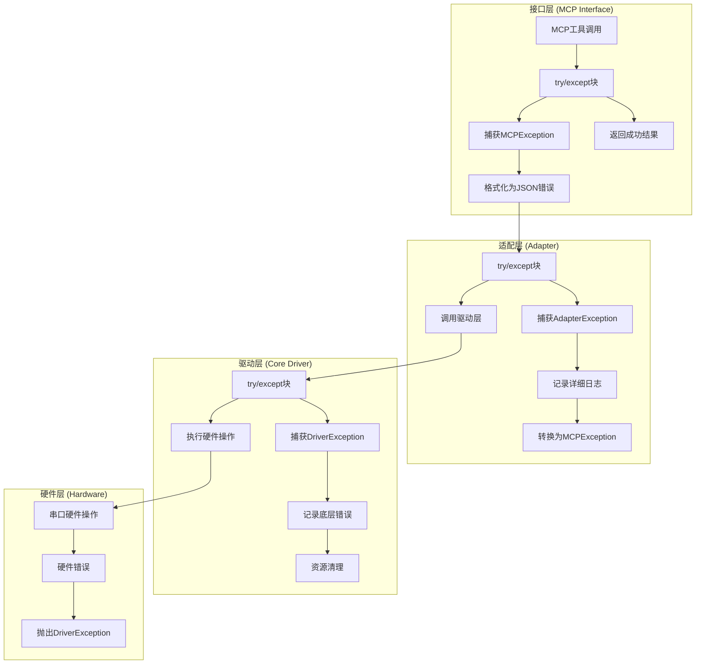
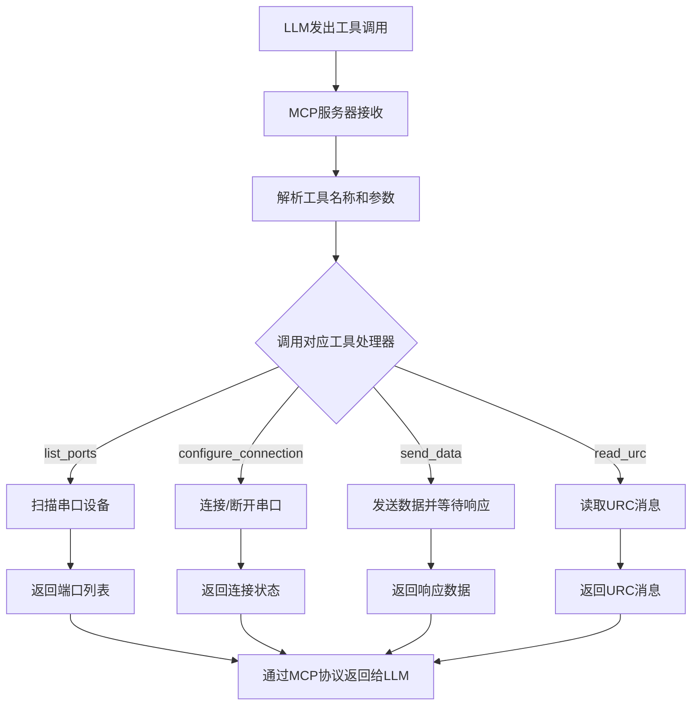

# 软件实现架构文档 - 实现细节

**版本:** V1.1
**项目:** Serial-Agent-MCP
**作者:** 高级 Python 开发工程师

## 1. 工程结构

### 1.1 项目目录结构

```
serial2mcp/
├── README.md                    # 项目说明文档
├── PROJECT_SUMMARY.md           # 项目概要说明
├── requirements.txt             # Python 依赖列表
├── setup.py                     # 包安装配置
├── pyproject.toml               # 现代Python项目配置
├── .gitignore                   # Git忽略文件
├── doc/                         # 详细设计文档
│   ├── 01-智能串口 MCP 工具需求规格说明书 (PRD).md
│   ├── 02-串口 MCP 工具接口定义契约 (Interface Schema).md
│   ├── 03-串口底层驱动设计规范 (Serial Driver Design Spec).md
│   ├── 04-系统集成与 AI 逻辑规范 (System Integration & AI Logic Spec).md
│   ├── 05-软件实现架构文档.md
│   └── 06-软件实现架构文档 - 实现细节.md
├── scripts/                     # 辅助脚本
│   ├── run_tests.sh             # 运行测试脚本
│   └── setup_dev_env.sh         # 开发环境设置脚本
├── src/                         # 源代码目录
│   └── serial2mcp/
│       ├── __init__.py
│       ├── main.py              # MCP服务器入口点
│       ├── server.py            # MCP服务器主类
│       ├── tools/               # MCP工具实现
│       │   ├── __init__.py
│       │   ├── base.py          # 基础工具类
│       │   ├── connection.py    # 连接管理工具
│       │   ├── communication.py # 通信工具
│       │   └── urc.py           # URC处理工具
│       ├── driver/              # 核心驱动层
│       │   ├── __init__.py
│       │   ├── serial_driver.py # 串口驱动主类
│       │   ├── reader.py        # 后台接收线程
│       │   ├── processor.py     # 数据处理器
│       │   └── connection_manager.py # 连接管理
│       ├── adapter/             # 适配层
│       │   ├── __init__.py
│       │   ├── wrapper.py       # 工具包装器
│       │   ├── converter.py     # 参数转换器
│       │   └── exception_handler.py # 异常处理器
│       └── utils/               # 工具类
│           ├── __init__.py
│           ├── logger.py        # 日志配置
│           ├── config.py        # 配置管理
│           └── exceptions.py    # 自定义异常
├── tests/                       # 测试代码
│   ├── __init__.py
│   ├── conftest.py              # pytest配置
│   ├── unit/                    # 单元测试
│   │   ├── test_driver/
│   │   ├── test_adapter/
│   │   └── test_tools/
│   ├── integration/             # 集成测试
│   │   ├── test_mcp_server.py
│   │   └── test_serial_flow.py
│   └── fixtures/                # 测试数据
│       └── mock_serial.py
├── htmlcov/                     # 代码覆盖率报告
└── .pytest_cache/               # pytest缓存目录
```

### 1.2 PEP 8 合规性

- 使用 4 个空格缩进
- 行长度限制为 88 字符 (Black 默认)
- 类名使用 PascalCase
- 函数和变量使用 snake_case
- 常量使用 UPPER_CASE
- 私有成员使用单下划线前缀

## 2. 依赖管理

### 2.1 核心依赖 (requirements.txt)

```
# 核心依赖
pyserial>=3.5              # 串口通信
mcp>=1.0.0                 # MCP协议实现
typing-extensions>=4.0.0   # 类型注解支持

# 异步支持
asyncio-mqtt>=0.13.0       # 异步MQTT支持(可选)

# 数据处理
numpy>=1.21.0              # 数值计算(可选)
protobuf>=3.20.0           # 协议缓冲区(可选)

# 日志和监控
structlog>=22.1.0          # 结构化日志
prometheus-client>=0.14.0  # 指标收集(可选)
```

### 2.2 开发依赖 (requirements-dev.txt)

```
# 测试框架
pytest>=7.0.0
pytest-asyncio>=0.20.0
pytest-cov>=4.0.0
pytest-mock>=3.8.0

# 代码质量
black>=22.0.0
isort>=5.10.0
flake8>=5.0.0
mypy>=0.991
pre-commit>=2.20.0

# 文档生成
sphinx>=5.0.0
sphinx-rtd-theme>=1.0.0
myst-parser>=0.18.0

# 开发工具
ipython>=8.0.0
jupyter>=1.0.0
```

### 2.3 依赖用途说明

| 库名称 | 版本要求 | 用途描述 |
|--------|----------|----------|
| pyserial | >=3.5 | 跨平台串口通信，支持Windows/Linux/macOS |
| fastmcp | >=0.2.0 | MCP协议的Python实现，提供服务器框架 |
| typing-extensions | >=4.0.0 | 向后兼容的类型注解支持 |
| structlog | >=22.1.0 | 结构化日志，便于调试和监控 |
| pytest | >=7.0.0 | 单元测试和集成测试框架 |

## 3. 错误处理策略

### 3.1 异常层级设计

```python
# utils/exceptions.py

class Serial2MCPException(Exception):
    """基础异常类，所有自定义异常的父类"""
    def __init__(self, message: str, error_code: str = None):
        super().__init__(message)
        self.message = message
        self.error_code = error_code

class SerialConnectionError(Serial2MCPException):
    """串口连接相关异常"""
    pass

class SerialDataError(Serial2MCPException):
    """串口数据处理异常"""
    pass

class InvalidInputError(Serial2MCPException):
    """无效输入异常"""
    pass

class TimeoutError(Serial2MCPException):
    """超时异常"""
    pass

class DriverNotInitializedError(Serial2MCPException):
    """驱动未初始化异常"""
    pass
```

### 3.2 异常捕获层级



### 3.3 Fail Fast 原则实现

```python
# adapter/exception_handler.py

import logging
from typing import Dict, Any
from ..utils.exceptions import (
    Serial2MCPException,
    SerialConnectionError,
    SerialDataError,
    InvalidInputError,
    TimeoutError as SerialTimeoutError
)

class ExceptionHandler:
    def __init__(self):
        self.logger = logging.getLogger("exception_handler")

    def handle_exception(self, exc: Exception) -> Dict[str, Any]:
        """
        统一异常处理，遵循 Fail Fast, Report Clearly 原则

        Args:
            exc: 捕获的异常

        Returns:
            格式化的错误响应字典
        """
        if isinstance(exc, Serial2MCPException):
            # 自定义异常，包含详细信息
            error_response = {
                "success": False,
                "error_message": exc.message,
                "error_code": exc.error_code
            }
            self.logger.error(f"Serial2MCP exception occurred: {exc.message}")
        elif isinstance(exc, (serial.SerialException, OSError)):
            # 串口相关异常
            error_response = {
                "success": False,
                "error_message": f"Serial port error: {str(exc)}",
                "error_code": "SERIAL_ERROR"
            }
            self.logger.error(f"Serial port error: {str(exc)}", exc_info=True)
        elif isinstance(exc, ValueError):
            # 参数验证错误
            error_response = {
                "success": False,
                "error_message": f"Invalid input: {str(exc)}",
                "error_code": "INVALID_INPUT"
            }
            self.logger.error(f"Invalid input: {str(exc)}")
        else:
            # 其他系统异常，保护敏感信息
            error_response = {
                "success": False,
                "error_message": "Internal system error",
                "error_code": "SYSTEM_ERROR"
            }
            self.logger.error(f"System exception: {str(exc)}", exc_info=True)

        return error_response
```

### 3.4 错误恢复策略

```python
# driver/connection_manager.py

class ConnectionManager:
    def __init__(self):
        self.retry_config = {
            "max_retries": 3,
            "backoff_factor": 2,
            "timeout": 5.0
        }
    
    def connect_with_retry(self, port: str, baudrate: int) -> bool:
        """
        带重试机制的连接方法
        
        Returns:
            bool: 连接是否成功
        """
        for attempt in range(self.retry_config["max_retries"]):
            try:
                self._connect(port, baudrate)
                return True
            except ConnectionException as e:
                if attempt == self.retry_config["max_retries"] - 1:
                    raise  # 最后一次重试失败，抛出异常
                
                wait_time = self.retry_config["backoff_factor"] ** attempt
                time.sleep(wait_time)
                logger.warning(f"Connection attempt {attempt + 1} failed, retrying in {wait_time}s")
        
        return False
```

## 4. 核心类实现示例

### 4.1 增强的全局单例管理

```python
# driver/serial_driver.py

import threading
import time
import queue
from typing import Optional, List, Dict, Any
from dataclasses import dataclass
from .reader import DataPacket, DataType

@dataclass
class ConnectionMetrics:
    """连接性能指标"""
    bytes_sent: int = 0
    bytes_received: int = 0
    packets_sent: int = 0
    packets_received: int = 0
    errors_count: int = 0
    average_response_time: float = 0.0
    uptime: float = 0.0
    last_activity: float = 0.0

class SerialDriverSingleton:
    """增强的全局单例管理器"""
    _instance: Optional['SerialDriver'] = None
    _lock = threading.Lock()
    
    @classmethod
    def get_instance(cls) -> 'SerialDriver':
        """获取全局单例实例"""
        if cls._instance is None:
            with cls._lock:
                if cls._instance is None:  # 双重检查锁定
                    cls._instance = SerialDriver()
        return cls._instance
    
    @classmethod
    def reset_instance(cls) -> None:
        """重置单例实例，主要用于测试"""
        with cls._lock:
            if cls._instance is not None:
                cls._instance.disconnect()
                cls._instance = None

class SerialDriver:
    """串口驱动主类，实现串口连接、数据收发等核心功能"""

    def __init__(self):
        """初始化串口驱动"""
        self.logger = get_logger("serial_driver")
        self.config = config_manager.get_config()
        self.connection_manager = ConnectionManager()
        self.background_reader = BackgroundReader()
        self.data_processor = DataProcessor()

        # 同步模式标志 - 用于区分同步响应和异步URC
        self._sync_mode = threading.Event()
        self._sync_response_queue = queue.Queue()
        self._urc_queue = queue.Queue(maxsize=self.config.driver.urc_buffer_size)

        # 驱动状态
        self._is_initialized = False
        self._is_connected = False

        # 同步操作相关
        self._current_operation_timeout = self.config.driver.sync_timeout_default

    def initialize(self) -> None:
        """初始化驱动"""
        try:
            self.connection_manager.initialize()
            self.background_reader.initialize(
                connection_manager=self.connection_manager,
                sync_mode_event=self._sync_mode,
                sync_response_queue=self._sync_response_queue,
                urc_queue=self._urc_queue
            )
            self.data_processor.initialize()

            self._is_initialized = True
            self.logger.info("串口驱动初始化完成")
        except Exception as e:
            self.logger.error(f"串口驱动初始化失败: {e}")
            raise SerialConnectionError(f"串口驱动初始化失败: {e}")

    def connect(self, port: str, baudrate: int = None) -> None:
        """
        连接串口

        Args:
            port: 串口设备路径
            baudrate: 波特率，默认使用配置中的值
        """
        if not self._is_initialized:
            raise DriverNotInitializedError("驱动未初始化")

        try:
            # 如果没有指定波特率，使用配置中的默认值
            if baudrate is None:
                baudrate = self.config.serial.baudrate

            self.connection_manager.connect(port, baudrate)
            self.background_reader.start()

            self._is_connected = True
            self.logger.info(f"串口连接成功: {port}@{baudrate}")
        except Exception as e:
            self.logger.error(f"串口连接失败: {e}")
            raise SerialConnectionError(f"串口连接失败: {e}")

    def disconnect(self) -> None:
        """断开串口连接"""
        try:
            # 停止后台读取线程
            self.background_reader.stop()

            # 断开连接
            self.connection_manager.disconnect()

            self._is_connected = False
            self.logger.info("串口连接已断开")
        except Exception as e:
            self.logger.error(f"串口断开连接失败: {e}")
            raise SerialConnectionError(f"串口断开连接失败: {e}")

    def is_connected(self) -> bool:
        """
        检查串口是否连接

        Returns:
            串口连接状态
        """
        return self._is_connected and self.connection_manager.is_connected()

    def send_data(self, data: bytes, wait_policy: str = 'none', stop_pattern: str = None,
                  timeout: float = 5.0, is_hex: bool = False) -> Dict[str, Any]:
        """
        发送数据并根据策略获取响应

        Args:
            data: 要发送的字节数据
            wait_policy: 等待策略 ('none', 'keyword', 'timeout', 'at_command')
            stop_pattern: 仅在 'keyword' 模式下有效，停止模式
            timeout: 等待超时时间（秒）
            is_hex: 是否为十六进制数据

        Returns:
            包含响应数据的字典
        """
        if not self.is_connected():
            raise SerialConnectionError("串口未连接")

        try:
            self.connection_manager.write(data)
            self.logger.debug(f"发送数据: {data.hex() if is_hex else data.decode('utf-8', errors='replace')}")

            # 根据策略获取响应
            if wait_policy == 'none':
                # 射后不理模式：直接发送数据
                self.connection_manager.write(data)
                return {
                    'success': True,
                    'message': '数据已发送，不等待响应',
                    'pending_urc_count': self.get_pending_urc_count()
                }
            elif wait_policy in ['keyword', 'timeout', 'at_command']:
                # 清空同步响应队列以避免之前的残留数据
                while not self._sync_response_queue.empty():
                    try:
                        self._sync_response_queue.get_nowait()
                    except queue.Empty:
                        break

                # 进入同步模式以捕获响应数据
                self._sync_mode.set()

                # 在发送前短暂延迟，确保模式切换生效
                time.sleep(0.001)

                # 发送数据前清空输入缓冲区，防止残留数据干扰
                self.connection_manager.flush_input()

                # 发送数据
                self.connection_manager.write(data)

                # 立即开始接收响应（在同步模式下）
                if wait_policy == 'keyword':
                    # 关键字模式：等待直到找到指定的停止模式
                    result = self._receive_until_keyword(stop_pattern, timeout)
                elif wait_policy == 'timeout':
                    result = self._receive_until_timeout(timeout)
                elif wait_policy == 'at_command':
                    # 专门针对AT指令的处理模式：等待回显+响应
                    original_cmd = data.decode('utf-8', errors='replace')
                    result = self._receive_at_response(original_cmd, timeout)

                # 退出同步模式
                self._sync_mode.clear()

                return result
            else:
                raise InvalidInputError(f"不支持的等待策略: {wait_policy}")

        except Exception as e:
            self.logger.error(f"数据发送失败: {e}")
            raise SerialDataError(f"数据发送失败: {e}")

    def _receive_until_keyword(self, stop_pattern: str, timeout: float) -> Dict[str, Any]:
        """接收数据直到找到指定关键词"""
        if not stop_pattern:
            raise InvalidInputError("停止模式不能为空")

        start_time = time.time()
        received_data = b""
        stop_pattern_bytes = stop_pattern.encode('utf-8')

        while time.time() - start_time < timeout:
            try:
                # 尝试从同步响应队列获取数据
                chunk = self._sync_response_queue.get(timeout=0.1)
                if chunk:
                    received_data += chunk
                    self.logger.debug(f"接收到数据块: {chunk!r}, 累计: {received_data!r}")

                    # 检查是否包含停止模式
                    if stop_pattern_bytes in received_data:
                        self.logger.debug(f"找到停止模式 '{stop_pattern}' 在数据中")
                        break
            except queue.Empty:
                # 继续等待
                continue

        # 如果超时仍未收到停止模式，则视为超时
        if stop_pattern_bytes not in received_data:
            self.logger.warning(f"接收超时，未找到停止模式: {stop_pattern}")
            raise SerialTimeoutError(f"接收超时，未找到停止模式: {stop_pattern}")

        # 记录接收数据到性能指标
        if received_data:
            # 尝试解码为字符串
            try:
                decoded_data = received_data.decode('utf-8')
                is_hex = False
            except UnicodeDecodeError:
                decoded_data = received_data.hex()
                is_hex = True

            return {
                'data': decoded_data,
                'raw_data': received_data,
                'is_hex': is_hex,
                'found_stop_pattern': stop_pattern_bytes in received_data,
                'bytes_received': len(received_data),
                'pending_urc_count': self.get_pending_urc_count(),
                'success': True
            }
        else:
            return {
                'data': '',
                'raw_data': b'',
                'is_hex': False,
                'found_stop_pattern': False,
                'bytes_received': 0,
                'pending_urc_count': self.get_pending_urc_count(),
                'success': True
            }

    def _receive_until_timeout(self, timeout: float) -> Dict[str, Any]:
        """在指定时间内接收所有数据"""
        start_time = time.time()
        received_data = b""

        while time.time() - start_time < timeout:
            try:
                # 尝试从同步响应队列获取数据
                chunk = self._sync_response_queue.get(timeout=0.1)
                if chunk:
                    received_data += chunk
            except queue.Empty:
                # 继续等待直到时间结束
                continue

        # 记录接收数据到性能指标
        if received_data:
            # 尝试解码为字符串
            try:
                decoded_data = received_data.decode('utf-8')
                is_hex = False
            except UnicodeDecodeError:
                decoded_data = received_data.hex()
                is_hex = True

            return {
                'data': decoded_data,
                'raw_data': received_data,
                'is_hex': is_hex,
                'bytes_received': len(received_data),
                'pending_urc_count': self.get_pending_urc_count(),
                'success': True
            }
        else:
            return {
                'data': '',
                'raw_data': b'',
                'is_hex': False,
                'bytes_received': 0,
                'pending_urc_count': self.get_pending_urc_count(),
                'success': True
            }

    def _receive_at_response(self, original_cmd: str, timeout: float) -> Dict[str, Any]:
        """接收AT命令响应，简单地在超时时间内收集所有数据"""
        # 直接使用超时接收方法收集所有数据
        return self._receive_until_timeout(timeout)

    def get_urc_messages(self, clear: bool = True) -> List[Dict[str, Any]]:
        """
        获取URC消息

        Args:
            clear: 是否清空URC队列

        Returns:
            URC消息列表
        """
        urc_messages = []

        while True:
            try:
                if clear:
                    urc_data = self._urc_queue.get_nowait()
                else:
                    urc_data = self._urc_queue.get(timeout=0.1)

                # 处理URC数据
                try:
                    decoded_data = urc_data.decode('utf-8')
                    is_hex = False
                except UnicodeDecodeError:
                    decoded_data = urc_data.hex()
                    is_hex = True

                urc_messages.append({
                    'data': decoded_data,
                    'raw_data': urc_data,
                    'is_hex': is_hex,
                    'timestamp': time.time()
                })
            except queue.Empty:
                break

        return urc_messages

    def get_pending_urc_count(self) -> int:
        """
        获取待处理的URC消息数量

        Returns:
            待处理URC消息数量
        """
        return self._urc_queue.qsize()

    def get_driver_status(self) -> Dict[str, Any]:
        """
        获取驱动状态

        Returns:
            驱动状态信息字典
        """
        return {
            'is_initialized': self._is_initialized,
            'is_connected': self.is_connected(),
            'sync_mode': self._sync_mode.is_set(),
            'pending_urc_count': self.get_pending_urc_count(),
            'sync_response_queue_size': self._sync_response_queue.qsize()
        }
```

### 4.2 智能数据分流后台接收线程

```python
# driver/reader.py

import time
import threading
import re
from queue import Queue, PriorityQueue
from typing import Optional, Dict, Any, List
from dataclasses import dataclass, field
from enum import Enum

class DataType(Enum):
    RESPONSE = "response"
    URC = "urc"
    UNKNOWN = "unknown"

@dataclass
class DataPacket:
    data: str
    is_hex: bool
    timestamp: float
    data_type: DataType
    priority: int = 0
    sequence_id: Optional[int] = None
    checksum: Optional[str] = None

class PatternMatcher:
    """数据模式识别引擎"""
    
    def __init__(self):
        # AT响应模式
        self.response_patterns = [
            r'\bOK\b',
            r'\bERROR\b',
            r'\bCONNECT\b',
            r'\bNO CARRIER\b',
            r'\bBUSY\b',
            r'\bNO ANSWER\b',
            r'\+r\d+,\d+',  # 通用响应格式
        ]
        
        # URC模式
        self.urc_patterns = [
            r'\+CMTI:',     # 短信通知
            r'\+CMT:',      # 短信内容
            r'\+CLIP:',     # 来电显示
            r'\+CREG:',     # 网络注册
            r'\+CGATT:',    # GPRS附着
            r'\+QIURC:',    # 移远URC
            r'\+TCP',       # TCP相关
            r'\+UDP',       # UDP相关
        ]
        
        # 编译正则表达式
        self.response_regex = [re.compile(pattern, re.IGNORECASE) 
                             for pattern in self.response_patterns]
        self.urc_regex = [re.compile(pattern, re.IGNORECASE) 
                         for pattern in self.urc_patterns]
    
    def identify_data_type(self, data: str, context: Dict[str, Any]) -> DataType:
        """智能识别数据类型"""
        # 首先检查明确的模式匹配
        for regex in self.response_regex:
            if regex.search(data):
                return DataType.RESPONSE
        
        for regex in self.urc_regex:
            if regex.search(data):
                return DataType.URC
        
        # 基于上下文判断
        if context.get('sync_mode', False):
            # 同步模式下，优先认为是响应
            if self._likely_response(data):
                return DataType.RESPONSE
        
        # 默认根据模式判断
        return DataType.URC if context.get('idle_mode', False) else DataType.UNKNOWN
    
    def _likely_response(self, data: str) -> bool:
        """判断是否可能是响应数据"""
        # 简单的启发式规则
        indicators = ['OK', 'ERROR', '>', 'CONNECT', 'busy', 'no carrier']
        return any(indicator.lower() in data.lower() for indicator in indicators)

class DelayedURCBuffer:
    """URC延迟缓冲区"""
    
    def __init__(self, max_delay: float = 0.005):  # 5ms最大延迟
        self.buffer: List[DataPacket] = []
        self.max_delay = max_delay
        self.lock = threading.Lock()
    
    def add(self, packet: DataPacket) -> None:
        """添加URC到延迟缓冲区"""
        with self.lock:
            self.buffer.append(packet)
    
    def flush(self) -> List[DataPacket]:
        """清空缓冲区并返回所有URC"""
        with self.lock:
            packets = self.buffer.copy()
            self.buffer.clear()
            return packets
    
    def should_flush(self, current_time: float) -> bool:
        """检查是否应该刷新缓冲区"""
        if not self.buffer:
            return False
        
        oldest_packet = self.buffer[0]
        return current_time - oldest_packet.timestamp > self.max_delay

class BackgroundReader(threading.Thread):
    def __init__(self, driver: 'SerialDriver'):
        super().__init__(daemon=True)
        self.driver = driver
        self.IDLE_THRESHOLD = 0.1  # 100ms
        self.MICRO_WINDOW = 0.01   # 10ms微窗口
        
        # 智能分流组件
        self.pattern_matcher = PatternMatcher()
        self.delayed_urc_buffer = DelayedURCBuffer()
        
        # 序列号管理
        self.sequence_counter = 0
        self.sequence_lock = threading.Lock()
        
        # 性能统计
        self.stats = {
            'total_packets': 0,
            'response_packets': 0,
            'urc_packets': 0,
            'unknown_packets': 0,
            'delayed_urc_count': 0
        }
    
    def run(self) -> None:
        """后台接收线程主循环"""
        while not self.driver._stop_event.is_set():
            try:
                current_time = time.time()
                
                if self.driver._connection.in_waiting > 0:
                    # 读取数据
                    raw_data = self.driver._connection.read(self.driver._connection.in_waiting)
                    self._process_data_intelligent(raw_data, current_time)
                else:
                    # 检查空闲超时和延迟缓冲区
                    self._check_timeouts(current_time)
                
                time.sleep(0.005)  # 5ms 间隔，提高响应性
                
            except Exception as e:
                logger.error(f"Error in background reader: {str(e)}")
                break
    
    def _process_data_intelligent(self, raw_data: bytes, current_time: float) -> None:
        """智能数据处理"""
        # 解码数据
        try:
            text_data = raw_data.decode('utf-8')
            is_hex = False
        except UnicodeDecodeError:
            text_data = raw_data.hex(' ')
            is_hex = True
        
        # 创建数据包
        packet = self._create_data_packet(text_data, is_hex, current_time)
        
        # 智能分流
        context = {
            'sync_mode': self.driver._sync_mode.is_set(),
            'idle_mode': not self.driver._sync_mode.is_set(),
            'recent_commands': getattr(self.driver, '_recent_commands', [])
        }
        
        data_type = self.pattern_matcher.identify_data_type(text_data, context)
        packet.data_type = data_type
        
        # 根据数据类型和模式处理
        if self.driver._sync_mode.is_set():
            self._handle_sync_mode_intelligent(packet, current_time)
        else:
            self._handle_idle_mode_intelligent(packet)
        
        # 更新统计
        self._update_stats(data_type)
    
    def _create_data_packet(self, data: str, is_hex: bool, timestamp: float) -> DataPacket:
        """创建数据包"""
        with self.sequence_lock:
            self.sequence_counter += 1
            sequence_id = self.sequence_counter
        
        # 计算校验和
        checksum = self._calculate_checksum(data)
        
        return DataPacket(
            data=data,
            is_hex=is_hex,
            timestamp=timestamp,
            data_type=DataType.UNKNOWN,
            sequence_id=sequence_id,
            checksum=checksum
        )
    
    def _calculate_checksum(self, data: str) -> str:
        """计算简单校验和"""
        if not data:
            return "0"
        
        # 简单的异或校验
        checksum = 0
        for char in data.encode('utf-8'):
            checksum ^= char
        
        return f"{checksum:02x}"
    
    def _handle_sync_mode_intelligent(self, packet: DataPacket, current_time: float) -> None:
        """智能同步模式处理"""
        if packet.data_type == DataType.URC:
            # URC进入延迟缓冲区
            self.delayed_urc_buffer.add(packet)
            self.stats['delayed_urc_count'] += 1
        else:
            # 响应数据直接处理
            self._send_to_response_queue(packet)
            
            # 检查是否有延迟的URC需要处理
            if self.delayed_urc_buffer.should_flush(current_time):
                self._flush_delayed_urc()
    
    def _handle_idle_mode_intelligent(self, packet: DataPacket) -> None:
        """智能空闲模式处理"""
        # 空闲模式下，所有数据都作为URC处理
        packet.data_type = DataType.URC
        self.driver._urc_buffer.append(packet)
        self.driver._last_received_time = time.time()
    
    def _send_to_response_queue(self, packet: DataPacket) -> None:
        """发送到响应队列"""
        self.driver._response_queue.put({
            "data": packet.data,
            "is_hex": packet.is_hex,
            "timestamp": packet.timestamp,
            "sequence_id": packet.sequence_id,
            "checksum": packet.checksum,
            "data_type": packet.data_type.value
        })
    
    def _flush_delayed_urc(self) -> None:
        """刷新延迟的URC"""
        delayed_packets = self.delayed_urc_buffer.flush()
        
        for packet in delayed_packets:
            # 将延迟的URC放入URC队列
            urc_message = {
                "data": packet.data,
                "is_hex": packet.is_hex,
                "timestamp": packet.timestamp,
                "sequence_id": packet.sequence_id,
                "checksum": packet.checksum,
                "delayed": True
            }
            self.driver._urc_queue.put(urc_message)
    
    def _check_timeouts(self, current_time: float) -> None:
        """检查各种超时"""
        # 检查空闲超时
        if (self.driver._urc_buffer and 
            current_time - self.driver._last_received_time > self.IDLE_THRESHOLD):
            self._pack_urc_buffer()
        
        # 检查延迟URC缓冲区
        if self.delayed_urc_buffer.should_flush(current_time):
            self._flush_delayed_urc()
    
    def _pack_urc_buffer(self) -> None:
        """打包URC缓冲区数据（增强版）"""
        if not self.driver._urc_buffer:
            return
        
        # 按时间戳排序
        sorted_packets = sorted(self.driver._urc_buffer, key=lambda p: p.timestamp)
        
        # 合并数据并保留元信息
        combined_data = []
        is_hex = False
        total_checksum = 0
        
        for packet in sorted_packets:
            combined_data.append(packet.data)
            is_hex = is_hex or packet.is_hex
            if packet.checksum:
                total_checksum ^= int(packet.checksum, 16)
        
        # 创建增强的URC消息
        urc_message = {
            "data": "\n".join(combined_data),
            "is_hex": is_hex,
            "timestamp": sorted_packets[0].timestamp,
            "packet_count": len(sorted_packets),
            "sequence_ids": [p.sequence_id for p in sorted_packets],
            "combined_checksum": f"{total_checksum:02x}"
        }
        
        # 放入URC队列
        self.driver._urc_queue.put(urc_message)
        
        # 清空缓冲区
        self.driver._urc_buffer.clear()
    
    def _update_stats(self, data_type: DataType) -> None:
        """更新性能统计"""
        self.stats['total_packets'] += 1
        
        if data_type == DataType.RESPONSE:
            self.stats['response_packets'] += 1
        elif data_type == DataType.URC:
            self.stats['urc_packets'] += 1
        else:
            self.stats['unknown_packets'] += 1
    
    def get_stats(self) -> Dict[str, Any]:
        """获取性能统计"""
        return self.stats.copy()
```

## 5. 适配层实现

### 5.1 工具包装器核心处理流程

SerialToolWrapper 是连接MCP接口和底层驱动的桥梁，主要处理流程如下：

1. **list_ports 工具**
   - 使用 pyserial 库扫描系统串口设备
   - 返回设备列表（端口、描述、硬件ID）

2. **configure_connection 工具**
   - 解析 action 参数（open/close）
   - open: 调用 driver.connect() 连接指定串口
   - close: 调用 driver.disconnect() 断开当前连接

3. **send_data 工具（核心）**
   - 参数验证和转换
   - 根据 wait_policy 选择相应策略
   - 调用驱动层发送数据
   - 返回结果并计数待处理URC

4. **read_urc 工具**
   - 从驱动层获取URC消息队列
   - 清空已读取消息
   - 返回URC列表

### 5.2 数据格式转换处理流程

参数转换器的主要功能是将MCP协议参数转换为驱动层可用的数据格式：

1. **编码转换策略**
   - UTF-8: 处理转义字符后编码为字节
   - HEX: 清理非十六进制字符后转换为字节

2. **参数验证机制**
   - 类型检查
   - 格式验证
   - 范围检查

## 6. MCP服务器处理流程

### 6.1 请求处理流程



### 6.2 异常处理机制

- 统一异常捕获和处理
- 错误信息标准化
- 保护敏感信息不泄露

## 7. 配置管理

### 7.1 配置加载流程

配置管理器负责加载和管理应用配置：

1. **配置结构**
   - SerialConfig: 串口相关配置（波特率、超时等）
   - DriverConfig: 驱动相关配置（缓冲区大小、超时等）
   - AppConfig: 组合所有配置

2. **配置加载**
   - 从文件加载
   - 从环境变量加载
   - 提供默认值

### 7.2 配置使用

- 通过 config_manager 全局实例访问
- 配置在应用启动时加载
- 运行时只读配置

## 8. 测试策略

### 8.1 单元测试策略

单元测试主要针对各个组件的独立功能进行测试：

1. **驱动层测试**
   - 串口连接/断开功能
   - 数据发送/接收功能
   - 不同等待策略的处理

2. **适配层测试**
   - 工具参数验证
   - 参数转换功能
   - 异常处理机制

3. **工具方法测试**
   - 每个MCP工具的功能测试
   - 边界条件和异常情况测试

### 8.2 集成测试策略

集成测试验证整个MCP服务器的端到端功能：

1. **工具端点测试**
   - 端到端的工具调用流程
   - 参数传递和结果返回
   - 错误情况处理

2. **实时数据交互测试**
   - 串口数据流处理
   - 同步/异步模式切换
   - URC消息处理

## 9. 性能优化

### 9.1 并发处理优化

1. **后台数据接收**
   - 使用守护线程持续接收数据
   - 通过事件标志控制数据流向
   - 避免主线程阻塞

2. **数据分流机制**
   - 同步模式：数据流向响应队列
   - 异步模式：数据流向URC队列
   - 通过线程安全队列保证数据完整性

### 9.2 内存管理优化

1. **缓冲区管理**
   - 限制URC缓冲区大小
   - 及时清理过期数据
   - 防止内存泄漏

2. **数据处理优化**
   - 适时的数据格式转换
   - 遵活的编码适配策略
   - 高效的数据传递机制

### 9.3 监控与指标收集

性能指标收集用于系统监控和优化：

1. **连接指标**
   - 连接尝试次数
   - 成功/失败统计
   - 运行时间

2. **数据传输指标**
   - 发送/接收字节数
   - 消息数量统计
   - 错误计数
   - 平均响应时间

---

*本文档详细描述了软件实现的技术细节，为开发团队提供了具体的实现指导。*