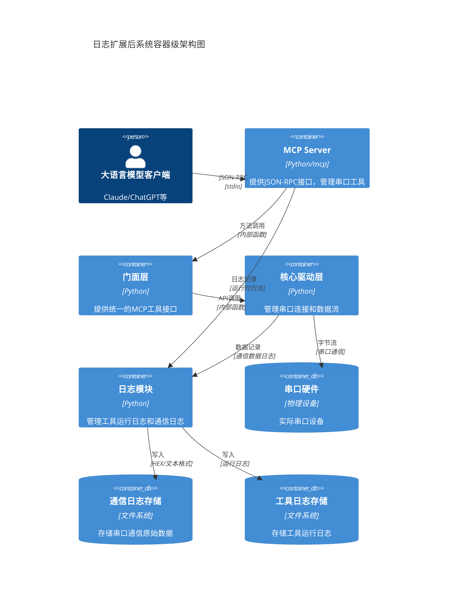
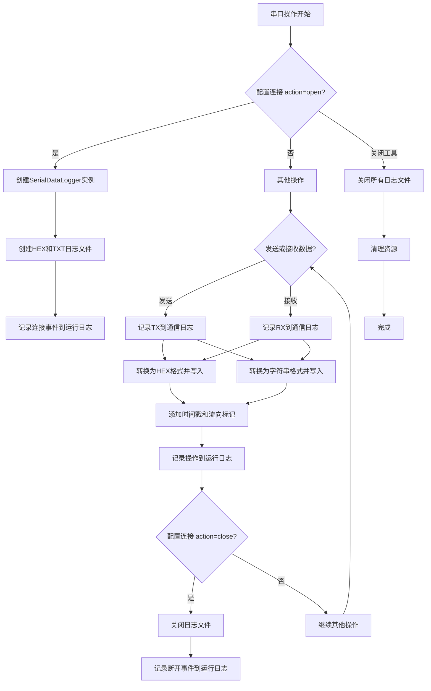
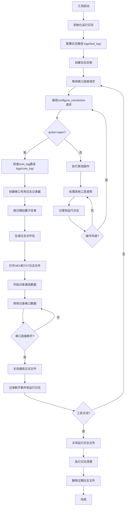
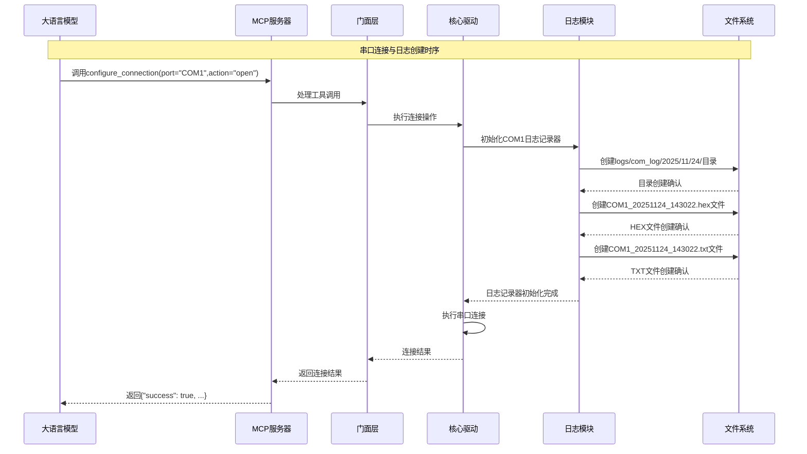
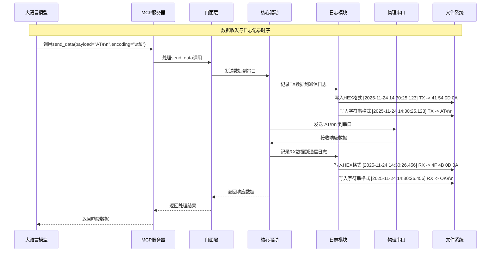

# 日志存储功能扩展实现细节文档

**版本号:** V1.2
**项目代号:** Serial-Agent-MCP
**创建日期:** 2025年11月24日

## 1. 扩展概述

本文档详细描述了智能串口MCP工具日志存储功能的扩展实现细节，包括串口通信原始数据日志和工具运行日志的实现方案、处理逻辑、扩展方法以及相关图表。

## 2. 系统架构扩展

### 2.1 扩展后的系统架构

## 3. 串口通信日志实现细节

### 3.1 串口数据日志处理逻辑

串口通信原始数据日志功能将在串口连接管理模块中扩展，当串口打开时自动创建对应的日志文件，记录所有进出串口的数据。

**数据记录逻辑：**
1. 当执行 `configure_connection` 操作且 action 为 "open" 时，为当前串口创建日志记录器
2. 为该串口创建两个日志文件：HEX格式和字符串格式
3. 所有通过串口的数据（发送Tx和接收Rx）都会同时记录到这两个文件中
4. 每条记录包含时间戳、数据流向和数据内容
5. 当串口关闭或工具停止时，关闭对应的日志文件

### 3.2 日志记录扩展方法

**3.2.1 日志记录器类设计**
- 扩展 `SerialDriver` 类，添加日志记录功能
- 创建 `SerialDataLogger` 类负责具体的日志记录操作
- 在串口连接管理模块中集成日志记录器的生命周期管理

**3.2.2 数据格式转换逻辑**
- 发送数据时：将原始字节序列同时转换为HEX字符串和可读字符串格式
- 接收数据时：同样记录为两种格式
- 使用结构化的日志格式：`[时间戳] [流向] [数据内容]`

**3.2.3 时间戳和流向标记**
- 所有日志记录包含精确到毫秒的时间戳
- 明确标记数据流向（TX表示发送，RX表示接收）
- 支持自定义日志格式以适应不同的分析需求

### 3.3 串口日志文件管理

**3.3.1 文件命名约定**
- 格式：`{port}_{timestamp}.{format}`
- 示例：`COM1_20251124_143022.hex` 和 `COM1_20251124_143022.txt`
- 使用ISO 8601时间格式，确保时间顺序清晰

**3.3.2 文件路径结构**
- 主目录：`logs/com_log/`
- 按日期分组：`logs/com_log/2025/11/24/`
- 每个串口连接创建独立的文件集

## 4. 工具运行日志实现细节

### 4.1 运行日志处理逻辑

工具运行日志将继续使用结构化日志记录库（如structlog），并扩展文件输出功能。所有工具调用、错误信息、状态变更等都会记录到运行日志中。

**运行日志记录逻辑：**
1. 工具启动时初始化运行日志处理器
2. 同时保持控制台输出和文件输出
3. 记录工具调用、参数验证、执行结果、错误信息等
4. 日志文件按大小或时间进行轮转

### 4.2 日志配置扩展

**4.2.1 配置参数扩展**
- `logging.com_log.enabled`: 是否启用串口通信日志
- `logging.tool_log.enabled`: 是否启用工具运行日志
- `logging.com_log.path`: 串口日志存储路径
- `logging.tool_log.path`: 工具日志存储路径
- `logging.retention_days`: 日志保留天数
- `logging.max_file_size`: 最大文件大小

**4.2.2 动态配置支持**
- 支持运行时重新加载日志配置
- 支持通过环境变量覆盖配置参数
- 提供默认配置以确保基本功能可用

## 5. 处理流程图

### 5.1 串口通信日志记录流程

### 5.2 日志文件生命周期管理流程

## 6. 时序图

### 6.1 串口连接与日志创建时序

### 6.2 数据收发与日志记录时序

## 7. 并发和线程安全考虑

### 7.1 线程安全日志记录

由于串口操作在多线程环境中进行，日志记录必须确保线程安全：

1. 每个串口连接使用独立的日志记录器实例
2. 日志写入操作使用线程安全的文件操作
3. 串口连接状态与日志记录器生命周期同步

### 7.2 异步日志记录

为避免日志写入阻塞主要功能，采用以下策略：

1. 使用缓冲区暂存日志数据
2. 异步写入日志文件
3. 异常处理确保日志完整性

## 8. 扩展接口定义

### 8.1 日志相关的扩展配置接口

在现有的MCP工具接口基础上，可扩展以下管理功能（可选实现）：

- `get_log_files`: 获取当前日志文件列表
- `rotate_logs`: 手动触发日志轮转
- `cleanup_logs`: 清理过期日志文件

## 9. 错误处理和恢复

### 9.1 日志写入错误处理

1. 当日志写入失败时，记录错误到运行日志但不中断主要功能
2. 实现日志写入重试机制
3. 磁盘空间不足时的降级处理

### 9.2 文件系统异常处理

1. 检测磁盘空间，在不足时发出警告
2. 文件权限异常的处理和报告
3. 文件系统损坏时的数据保护机制

## 10. 性能优化策略

### 10.1 I/O性能优化

1. 使用缓冲写入减少磁盘I/O操作
2. 实现异步日志写入避免阻塞
3. 适当调整缓冲区大小以平衡内存使用和性能

### 10.2 存储空间优化

1. 配置合理的日志轮转策略
2. 实现日志压缩功能
3. 提供日志清理和归档功能